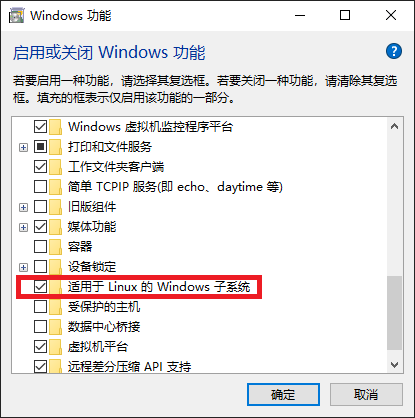
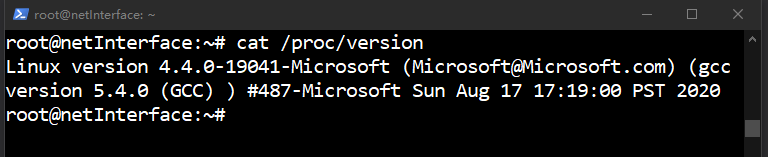
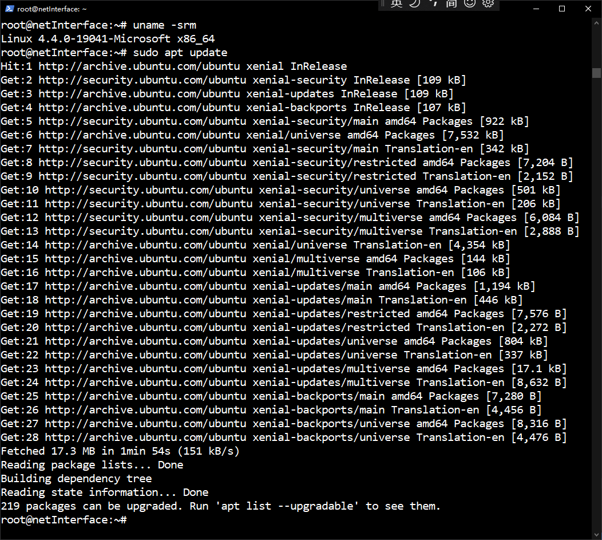

# WSL


# 1 安装

打开控制面板，选择程序和功能，点击“启用或关闭 Windows 功能”后出现如下
对话框：



勾选“适用于 Linux 的 Windows 子系统”后点击确定。

其后在更新和安全中勾选“开发人员模式”。

打开应用商店，搜索 Linux，选择安装 Ubuntu。

安装过程中你需要输入用户名和密码。

安装完成后查看一下版本：



然后进行一下更新，执行如下命令：
```shell
uname -srm
sudo apt update
```
效果如下：



当然这之前如果为了加快更新速度可以更换国内源，参见：
[Ubuntu: 更换国内源](https://www.jianshu.com/p/eb9bd6142c71)

