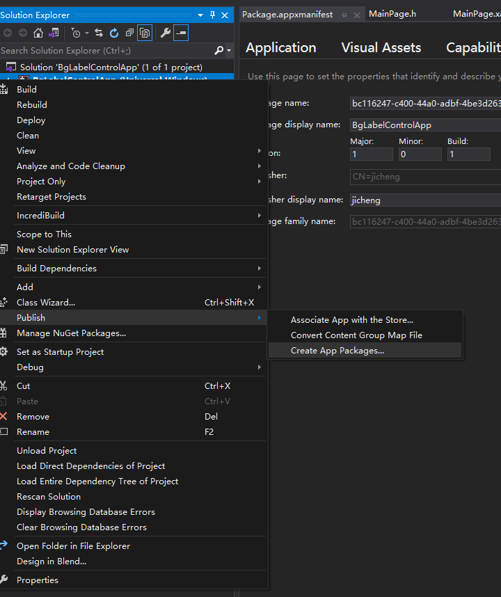

# Package a desktop or UWP app in Visual Studio

<https://docs.microsoft.com/en-us/windows/msix/package/packaging-uwp-apps>

***

This article describes the process of configuring, creating, and testing 
an MSIX package using Visual Studio.

steps to prepare and create an app package:
1. Before packaging your app. Follow these steps to ensure your app is ready to be packaged.
2. Configure your project. Use the Visual Studio manifest designer to configure the package. For example, add tile images and choose the orientations your app supports.
3. Generate an app package. Use the Visual Studio packaging wizard to create an app package.
4. Run, debug, and test a packaged application. Run and debug your app package from Visual Studio or by installing the package directly.

## 1 Before packaging your app

## 2 Configure your project

The app manifest file (Package.appxmanifest) is an XML file that contains 
the properties and settings required to create your app package. For 
example, properties in the app manifest file describe the image to use as 
the tile of your app and the orientations that your app supports when a 
user rotates the device.

The Visual Studio manifest designer allows you to update the manifest 
file without editing the raw XML of the file.

### 2.1 Configure a package with the manifest designer
1. In Solution Explorer, expand the project node of your application project.
2. Double-click the Package.appxmanifest file. If the manifest file is 
already open in the XML code view, Visual Studio prompts you to close the 
file.
3. Now you can decide how to configure your app. Each tab contains 
information that you can configure about your app and links to more 
information if necessary.

From the Packaging tab, you can enter publishing data. This is where you 
can choose which certificate to use to sign your app. All MSIX apps must 
be signed with a certificate.

If you are installing the app package on your device, you first need to 
trust the package. To trust the package, the certificate must be 
installed on the user's device.

4. Save your Package.appxmanifest file after you have made the necessary 
edits for your app.

## 3 Generate an app package

### 3.1 Create an app package using the packaging wizard

## 5 Create your app package upload file using Visual Studio

1. In Solution Explorer, open the solution for your UWP app project.
2. Right-click the project and choose Publish->Create App Packages. If 
this option is disabled or does not appear at all, check that the project 
is a Universal Windows project. 
 

The Create App Packages wizard appears.

makecert

