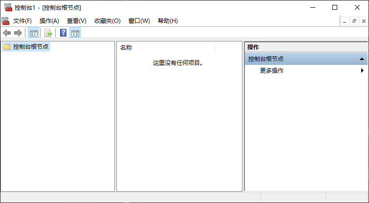
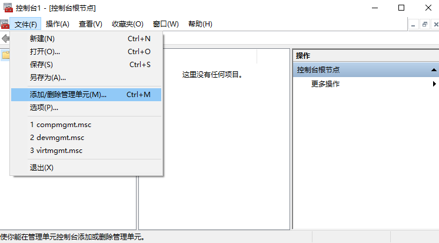
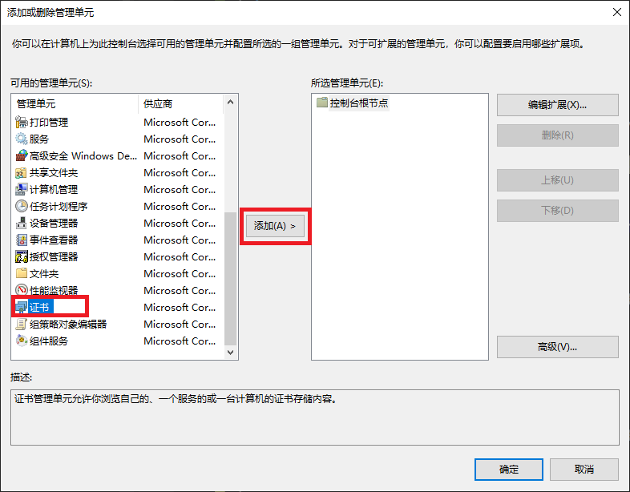
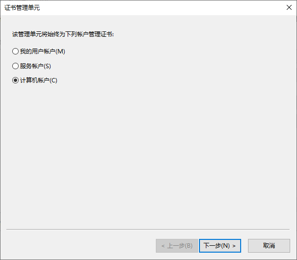
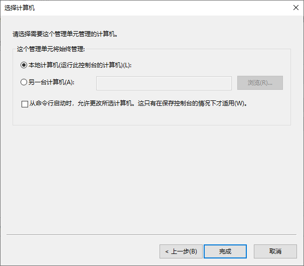
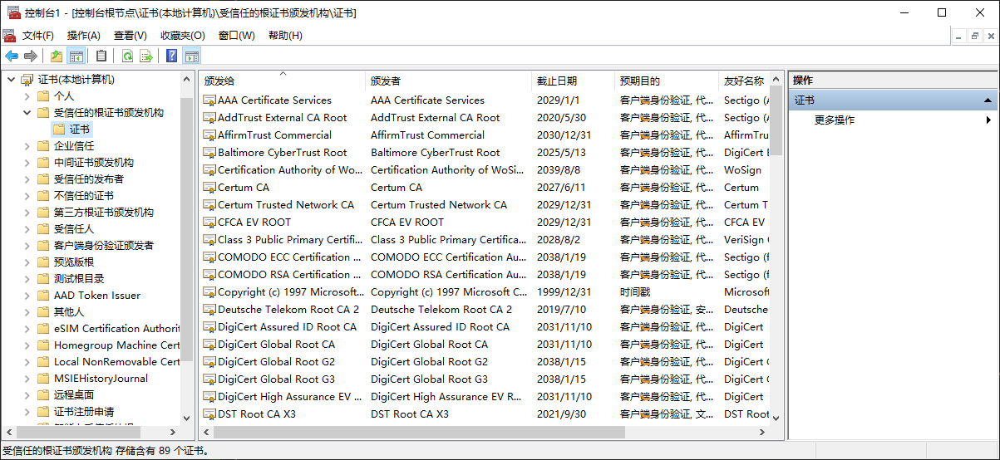

# View certificates with the MMC snap-in

[How to: View certificates with the MMC snap-in](https://docs.microsoft.com/en-us/dotnet/framework/wcf/feature-details/how-to-view-certificates-with-the-mmc-snap-in)

***

The following procedure demonstrates how to examine the stores on your 
local device to find an appropriate certificate:

1. Shortcuts win + R, and then enter mmc.

The MMC (Microsoft Management Console) appears.

2. From the File menu, select Add/Remove Snap In (添加/删除 管理单元).

The Add or Remove Snap-ins window appears.

3. From the Available snap-ins list, choose Certificates, then select Add.

4. In the Certificates snap-in window, select Computer account, and then 
select Next.

Optionally, you can select My user account for the current user or Service 
account for a particular service.

5. In the Select Computer window, leave Local computer selected, and then select Finish.

6. In the Add or Remove Snap-in window, select OK.

Optional: From the File menu, select Save or Save As to save the MMC console file for later use.

7. To view your certificates in the MMC snap-in, select Console Root in the 
left pane, then expand Certificates (Local Computer).

8. A list of directories for each type of certificate appears. From each 
certificate directory, you can view, export, import, and delete its 
certificates.

我们需要生成证书, 并将其添加到“受信任的根证书颁发机构”供应用程序的安装调试使用。

