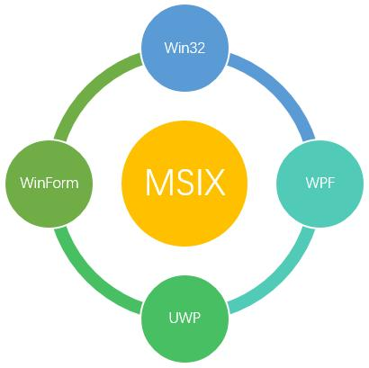

# Package a app in Visual Studio

<https://docs.microsoft.com/en-us/windows/msix/overview> 
<https://baijiahao.baidu.com/s?id=1663422050819291467&wfr=spider&for=pc>

***

两年前微软公布了 Windows 新的安装格式 MSIX，试图让软件安装和卸载流程更轻便，
更安全。
这个项目经过两年的发展，已经基本可以使用，接任 EXE 也只是时间问题。

## 1 MSI, EXE 和 AppX

传统 Windows 有3种安装格式：MSI, EXE 和 AppX。

* MSI 是 Windows 最基本的安装格式，使用微软的标准安装卸载界面，其中包含所要安装
软件的相关数据。使用简便但功能也简单。

* EXE 格式是一个可执行程序，能实现更多功能，比如检测已安装项，允许自定义安装路径，
检测安装缺失的必备运行库，更「花里胡哨」的安装界面等等。EXE 格式功能更丰富。

* AppX 用于安装 UWP 应用。
它继承了 MSI 的优点，就像手机软件的安装过程一样，几乎没有给用户任何选项，
允许直接覆盖升级，完全干净的卸载，Appx 程序运行在沙盒中，不能访问其他应用内存、
文件。这个安装格式之所以没有火起来，主要是对开发者太不友好，限制了软件权限，
封包 AppX 格式还必须重写。

## 2 MSI + AppX = MSIX

EXE 程序功能强大，也因此被恶意程序和流氓软件甚至病毒、木马利用，其在带来便利的
同时也带来极大的安全隐患。

APPX 相对 EXE 安全性有了质的提升，但又因为严苛的限制条件又伤害了开发者的利益，
从而无法在开发者社区传播使用。

MSI 又过于简单，用户和开发者都不喜欢用。

**MSIX 结合了 MSI 和APPX 的优点诞生**

MSIX 的安装过程类似 MSI 文件，但其背后的工作原理又类似 AppX 文件。

MSIX 安装器支持所有类型 Windows 应用的文件格式，包括 Win32、WPF、WinForm 
和 UWP。开发者只要遵循 MSIX 封装协议，将开发的应用程序封装为 .MSIX 格式后发布
到 Windows 10 应用商店，或其他网站，用户下载后就可以根据自己实际需要自行选择安
装方式。

使用 MSIX 安装的程序都被放在类似「沙盒」的环境中，所有文件、注册表都按规则存放
（例如 AppData 文件夹），卸载时所有数据都会被删除不会有残留。

并且，MSIX 格式可以给用户带来前所未有的安全感。因为能够使用的 MSIX 文件都必须
要有受信任的根签名，并且上传到应用商店的软件都需要经过微软的审核。

为了促进开发者使用新的格式，微软提供了非常简便的 MSIX 转换工具，开发人员可以直接
将现有的 EXE、MSI 或 AppX 文件转换为 MSIX 格式。

工具下载地址：<https://docs.microsoft.com/zh-cn/windows/msix/>

## 3 [Package a desktop or UWP app in Visual Studio](MSIX/packaging-uwp-apps.md)

请点击上面的标题进入相关页面阅读！

