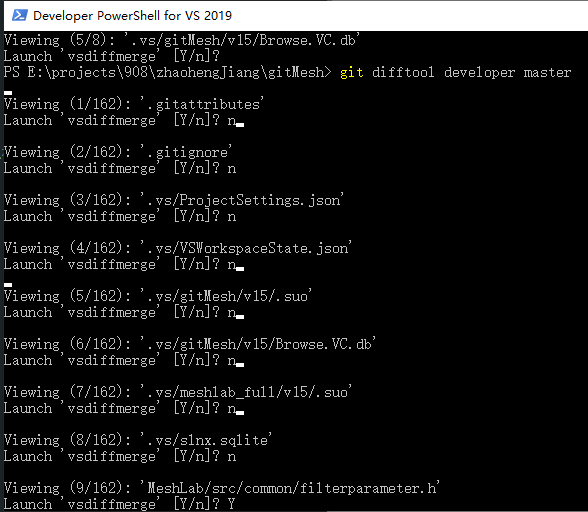

# GIT COMMAND MEMOIRE

This memoire records some frequenly used git commands used while coding in the 
VS 2019 Community Environment.

Targets of this memoire:
1. 如何在 vs 中对比2个文件的不同
2. 如何在 vs 中对比2个分支的不同
3. 如何在 vs 中对比2个提交的不同

* * *

## 0 Basic git commands

在 Developer PowerShell for VS 2019 中将路径该换到本地仓库，可执行如下命令来简单地向远程仓库推送更新：8xiaomi12

```shell
chcp 437

git status

git clone https://gitee.com/someones/somerepo.git

git push origin_gitee master
```

去掉已经托管的文件
```git
git rm -r --cached filename
```


### 0.1 git branch

```git
git branch -al                              // 查看本地和远程的所有分支

git add test.txt                            // 先添加一个新文件test.txt到 Git
git commit -m "add test.txt"    // 提交添加的文件
rm test.txt                                 // 删除工作区中的文件
git rm test.txt                             // 删除库中的文件
git commit -m "remove test.txt"     // 提交删除
git checkout -- test.txt                // 从版本库中恢复文件到工作区
```

### 0.2 git reset


在git push的时候，有时候我们会想办法撤销git commit的内容

1、找到之前提交的 git commit 的 id

```git log``` 找到想要撤销的id

2、git reset �Chard id 完成撤销, 同时将代码恢复到前一 commit_id 对应
的版本 

3、git reset id 完成撤销 git commit 到本地未push到远程仓库，但是不对
**代码修改进行撤销**，可以直接通过 git commit 重新提交对本地代码的修改


## 1 compare two files

用 VS 对比两个文件需要使用比对工具，该工具放在 TeamFoundation 文件夹里，路径是
D:\Program Files (x86)\Microsoft Visual Studio\2019\Community\Common7\IDE\CommonExtensions\Microsoft\TeamFoundation\Team Explorer\vsDiffMerge.exe 。

如果从 cmd 运行这个对比工具则需要加上上述路径，如果使用 Developer PowerShell for VS 2019 
则只需输入下面的代码：
```
vsDiffMerge.exe file1 file2
```
其中 file1 file2分别是进行对比的两个文件。运行后可以看到该软件在 VisualStudio 界面中对
两个文件进行对比，对比结果的显示非常直观。

## 2 compare two branches

如果使用的是 Powershell ，那么可以输入 cmd 进入命令行可以看到对比文件很好用，那么在 git 使用的默认比较分支是
```
git difftool developer master
```
就可以比较两个分支。个人测试需要先用 VS 打开相应的工程。



作为代码评阅者请简单记录代码对比结果，下面是一个例子：

| 文件 | 更改内容 |
| --- | --- |
| MeshLab/src/common/filterparameter.h | 添加了注释 |
| MeshLab/src/common/mlapplication.h | 更改了应用程序名称字符串 |
| MeshLab/src/meshlab/mainwindowt.h | 5处重要改动 |
| MeshLab/src/meshlabplugins/filter_ssynth/filter_ssynth.cpp | 1处改动, 屏蔽文档格式filter |
| MeshLab/src/meshlabplugins/io_ctm/io_ctm.cpp | importFormat & exportFormat |
| MeshLab/src/meshlabplugins/io_expe/export_xyz.h | save mesh |
| MeshLab/src/meshlabplugins/io_expe/io_expe.cpp | file type can be imported/exported |
| MeshLab/src/meshlabplugins/io_json/io_json.cpp | 屏蔽基于json的io |
| meshlab_full.sln | UID 改变 |
| vcglib/vcg/complex/algorithms/pointcloud_normal.h | 添加了注释 |

## 3 compare two commits

git reflog 查看 hash id 号
git difftool srcID dstID

作为代码评阅者请简单记录代码对比结果，下面是一个例子：

| 文件 | 更改内容 |
| --- | --- |
| MeshLab/src/meshlab/mainwindow.h | 增加 quantizeDepth 函数 |
| MeshLab/src/meshlab/mainwindow_RunTime.cpp | 实现量化并调用量化 |


