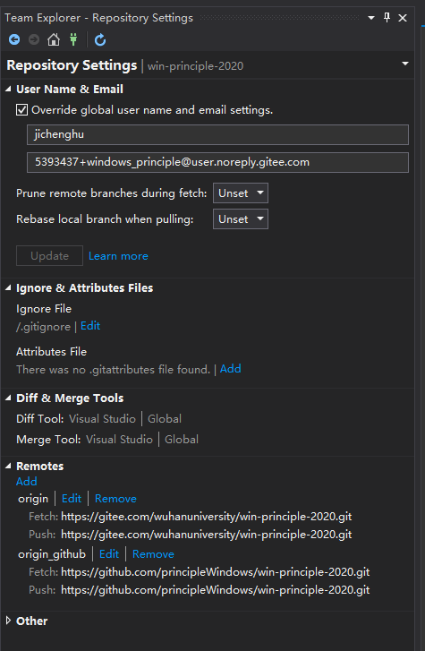
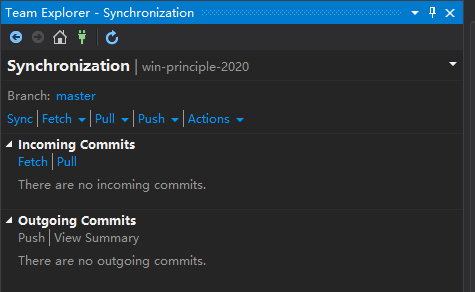
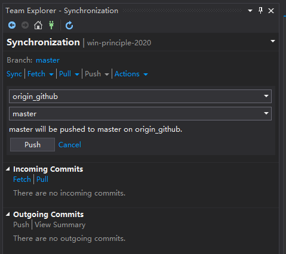

# 如何将本地 git 仓库同步推送到远程的 gitee 和 github 仓库

Windows 10 下将本地仓库推送到多个远程仓库方法很多，本课程下面推荐2种方法。
请大家在本课程的实验课上分别完成这两种方法，并将相应的实验情况写进实验报告。

在进行下面的实验之前你需要先在 gitee 及 github 上分别创建一个仓库来同步你本地仓库中的内容。
并为这两个仓库添加好密钥（可以相同，参见[使用 ssh-key](ssh_gitee.md)），以便建立 SSH 连接来访问相应的远程仓库。
下面我们假设你所创建好的两个仓库分别为：
1. https://gitee.com/someone/some_repo.git
2. https://github.com/someone/some_repo.git

## 1 使用命令行工具

你可以使用 Win10 自带的 Windows PowerShell 或者 Visual Studio 自带的 Developer PowerShell.
打开 Developer PowerShell 有两种方式：
1. 点击菜单项 View，然后点击 Terminal
2. 点击菜单项 Tools，然后点击 Command Line，接着点击 Developer PowerShell

在命令行下进入要推送的本地仓库所在的文件夹
(如果你使用 Developer PowerShell 且当前 VS 所打开的文件夹就是本地仓库所在的位置, 则命令行下的路径自动进入要推送的本地仓库)。
输入命令 git status 查看一下当前的状态。

增加 gitee 及 github 远程仓库（需要将本地仓库推送到这两个仓库）
```shell
git remote add origin_gitee https://gitee.com/someone/some_repo.git
git remote add origin_github https://github.com/someone/some_repo.git
```
上面命令为本地仓库创建了两个到远程仓库的连接，名字分别为 origin_gitee 和 origin_github 
(你也可以取为其它名字, 但通常缺省的名称为 origin)。

当你完成本地的 commit 后你就可以向远程仓库 push 了。将本地当前分支推送到 gitee 上的 master 分支:
```shell
git push -u origin_gitee master
```

将本地当前分支推送到 github 上的 master 分支:
```shell
git push -u origin_github master
```
请大家将上述实验过程分别截图，并将截图添加到你的实验报告中。


## 2 使用 VS 中的 Team Explorer 界面工具

先使用 VS 的 Open Folder 打开你本地仓库所在的目录。然后打开 Team Explorer 工具面板(点击 View 后再点击 Team Explorer)，
点击 Home 后再点击 Setting, 再在 git 标签下点击 Repository Settings 后出现类似如下的界面：



点击下方的蓝色的 Add 为本地仓库创建到远程仓库的连接（这里我分别创建了 origin 到 gitee，origin_github 到 github）。
你可以通过 Edit 来修改, 通过 Remove 来删除到远程仓库的连接。

连接建立好后我们就可以选择将当前提交推送到不同的远程仓库。点击 Home 后点击 Sync 将出现如下界面：



再点击 Push 右边的向下三角形，此时出现远程仓库连接的选择界面，可以选择不同的远程仓库连接及分支:



上图中选择的是 origin_github。再点击 Push 就可以将本地提交推送到所选择的远程连接及所选分支。
如果要提交到两个不同的远程仓库，上面的选择和 Push 就要分别做两次！

好了。远程仓库同步实验就到这里，其间如果你碰到任何问题，请将问题截图，并将问题的解决方法一并写入你的实验报告。


## 3 使用 VS2019 中的 Team Explorer进行代码同步时可能出现的问题及解决方案
### 问题一：


在初次使用git进行项目的版本管理时，如果是pull一个项目，往往会出现上面的错误提示：
原因分析：
这是由于没有设置Gitee的SSH公钥。在未设置SSH公钥的情况下，可以使用git clone Gitee上的项目，但是不能git push项目到Gitee上，如果想push项目到Gitee，那么必须配置SSH公钥。生成公钥和配置公钥的办法，可以参考Gitee帮助里面的文章，里面做了详细的介绍https://gitee.com/help/articles/4191 。

解决办法：

1、生成SSH公钥

`ssh-keygen -t rsa -C "xxxxx@xxxxx.com"`  


找到对应的目录：


找到gitee进行配置：


这里添加之后，在git push 的时候，发现还是会：


可能是你的这台电脑以前使用过git，所以保存的账号和密码是其他人的，所以需要进行修改账号和密码，步骤如下：

1.进入控制面板

2.选择用户账户

3.选择管理你的凭据

4.选择Windows凭据

5.选择git保存的用户信息

6.选择编辑或者进行删除操作

7.完成

第一步：


第二步：


第三步：


修改完成之后就OK了。

### 问题二：


解决方案：
进入控制面板
用户账号，选择管理您的凭据


修改凭据


用户名为手机号/姓名，密码为登录密码


修改完成后，保存即可

