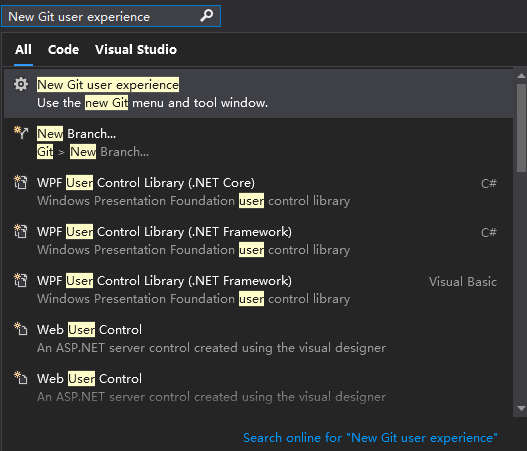
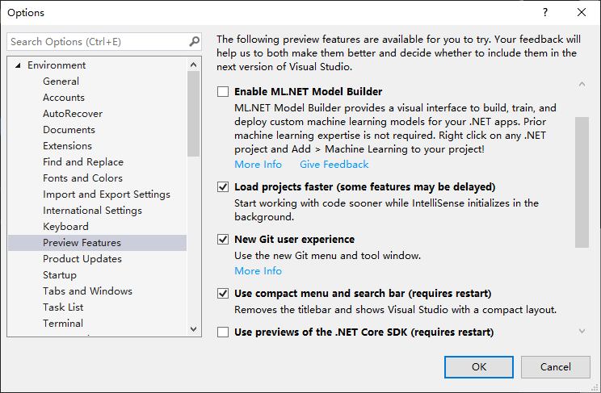

# New Git user experience

<https://devblogs.microsoft.com/visualstudio/exciting-new-updates-to-the-git-experience-in-visual-studio/>

***

If you¡¯re using the public Release of Visual Studio (version 
16.6+), then hit Ctrl+Q to search and type in ¡®New Git user 
experience¡¯ to turn it on from the Preview Features pane of 
Tools ¨C Options.

You can turn the experience off using the same checkbox.

