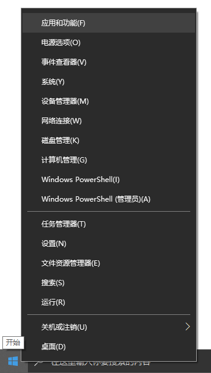
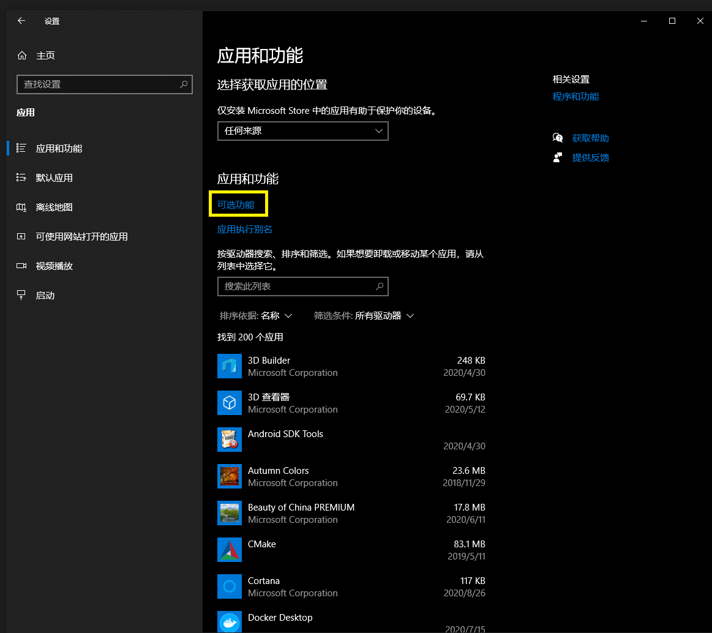
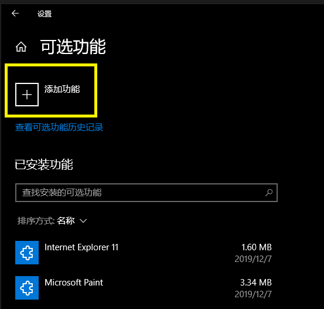
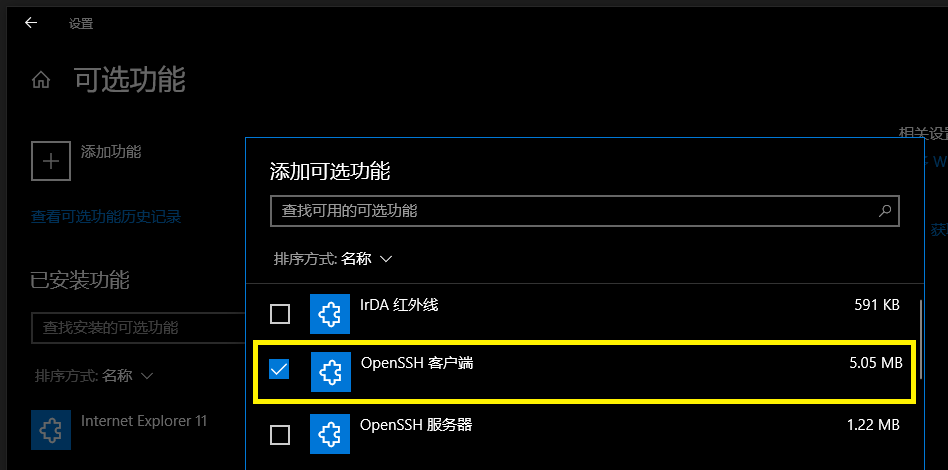
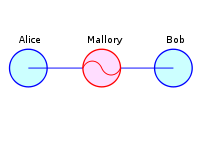

# win10 下安装 SSH client

## 1 右键点击 win10 的开始键

在最上面出现“应用和功能”

## 2 左键点击“应用和功能”

在“应用和功能”标签页面会出现“可选功能”（图中黄色框）

## 3 点击“可选功能”

## 4 点击“添加功能”前面的 + 号图标

点击安装即可将 OpenSSH 安装到 Win 10 系统中

# APPENDIX：INTRODUCTION TO SSH

## AppX 1 What is a Digital Signature?

[see http://www.youdzone.com/signature.html](http://www.youdzone.com/signature.html)

通过阅读上述文章了解"数字签名"（digital signature）和"数字证书"（digital certificate） 
如果你的英语阅读速度慢，下面是一个简略的中文翻译：

[chinese translation https://www.cnblogs.com/luckysimple/p/5258137.html](https://www.cnblogs.com/luckysimple/p/5258137.html)

[CA 认证参见 http://www.rootca.gov.cn/](http://www.rootca.gov.cn/)

## AppX 2 What is SSH

SSH 是一种网络协议，用于在计算机之间进行加密信息传输。
用户从本地计算机按照 SSH 协议与远程计算机交互通常是安全的，而且即便
被中途恶意截获，密钥也不会泄露。

早期的互联网都是明文通信，一旦被嗅探器截获信息就暴露。1995年芬兰学者
Tatu Ylonen 设计了 SSH 协议将所传输的信息加密后再在互联网上传输，逐步
发展成为了当今网络信息安全的一个基础框架。

本课程使用的是 Win10 自带的 OpenSSH，属于开源系统。

### AppX 2.1 Man in the Middle Attack

Material in this section is from wikipedia.org

攻击示例

中间人攻击示意图

假设爱丽丝（Alice）希望与鲍伯（Bob）通信。同时， 马洛里（Mallory）希望拦截窃会话以进行窃听并可能在某些时候传送给鲍伯一个虚假的消息。

首先，爱丽丝会向鲍勃索取他的公钥。如果Bob将他的公钥发送给Alice，并且此时马洛里能够拦截到这个公钥，一个中间人攻击就可以开展。马洛里发送给爱丽丝一个伪造的消息，声称自己是鲍伯，并且附上了马洛里自己的公钥（而不是鲍伯的）。

爱丽丝收到公钥后相信这个公钥是鲍伯的，于是爱丽丝将她的消息用马洛里的公钥（爱丽丝以为是鲍伯的）加密，并将加密后的消息回给鲍伯。马洛里再次截获爱丽丝回给鲍伯的消息，并使用马洛里自己的私钥对消息进行解密，如果马洛里愿意，她也可以对消息进行修改，然后马洛里使用鲍伯原先发给爱丽丝的公钥对消息再次加密。当鲍伯收到新加密后的消息时，他会相信这是从爱丽丝那里发来的消息。

1. 爱丽丝发送给鲍伯一条消息，被马洛里截获:

爱丽丝 “嗨，鲍勃，我是爱丽丝。给我你的公钥“ --> 马洛里           鲍勃

2. 马洛里将这条截获的消息转送给鲍伯；此时鲍伯不能分辨这条消息是否真的是从爱丽丝那里发来的:

爱丽丝          马洛里 “嗨，鲍勃，我是爱丽丝。给我你的公钥“ --> 鲍伯

3. 鲍伯回应爱丽丝的消息，并附上了他的公钥:

爱丽丝          马洛里 <-- [鲍伯的公钥]-- 鲍伯

4. 马洛里用自己的密钥替换了消息中鲍伯的密钥，并将消息转发给爱丽丝，声称这是鲍伯的公钥:

爱丽丝 <-- [马洛里的公钥]-- 马洛里          鲍勃

5. 爱丽丝用她以为是鲍伯的公钥加密了她的消息，以为只有鲍伯才能读到它:

爱丽丝 “我们在公共汽车站见面！”--[使用马洛里的公钥加密] --> 马洛里          鲍勃

6. 然而，由于这个消息实际上是用马洛里的密钥加密的，所以马洛里可以解密它，阅读它，并在愿意的时候修改它，然后使用鲍伯的密钥重新加密，并将重新加密后的消息转发给鲍伯:

爱丽丝          马洛里 “在家等我！”--[使用鲍伯的公钥加密] --> 鲍伯

7. 鲍勃认为，这条消息是经由安全的传输通道从爱丽丝那里传来的。

这个例子显示了爱丽丝和鲍伯需要某种方法来确定他们是真正拿到了属于对方的公钥，而不是拿到来自攻击者的公钥。否则，这类攻击一般都是可行的，在原理上，可以针对任何使用公钥――密钥技术的通讯消息发起攻击。幸运的是，有各种不同的技术可以帮助抵御MIM攻击

### AppX 2.2 SSH connection

SSH client 首次连接 SSH server 时会出现如下提示:

