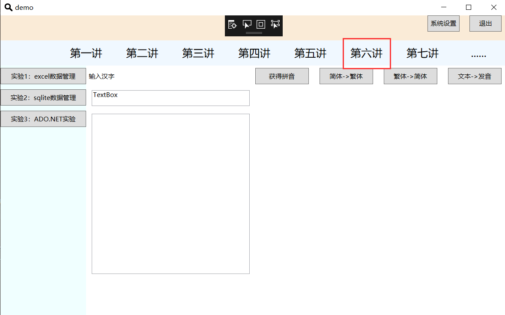
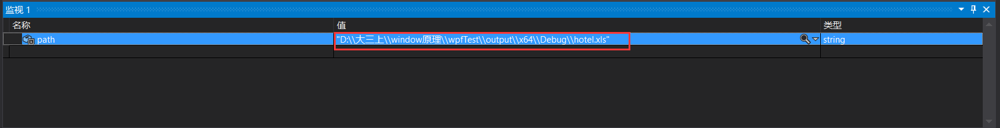
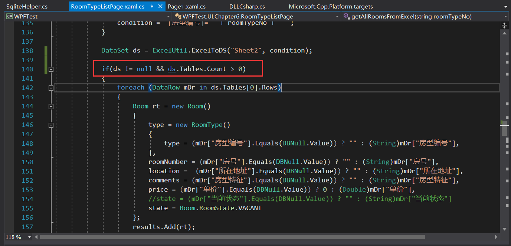
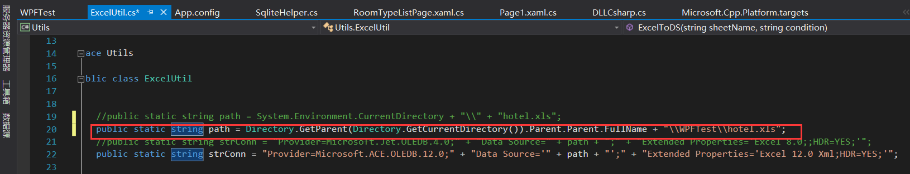
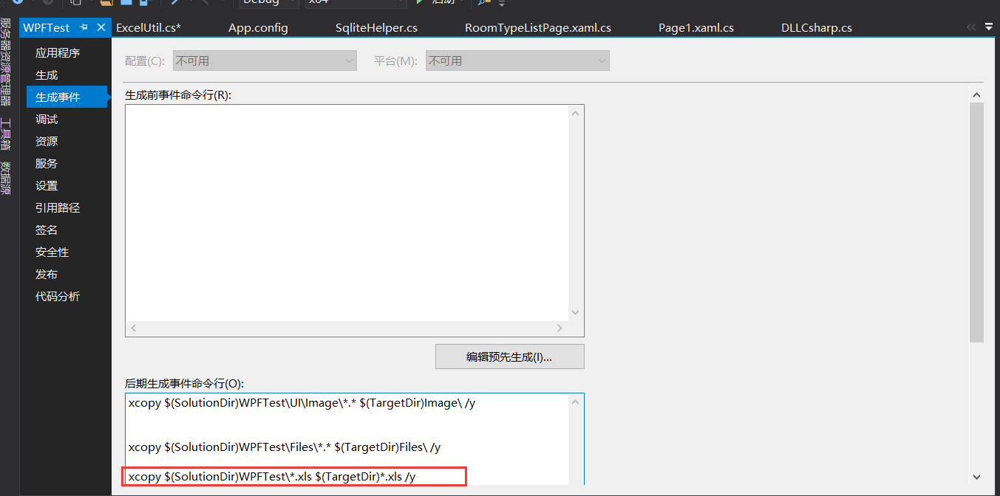

## WPFTest中一个问题的修复

### 点击第六讲出现的异常

将wpfTest从github上clone下来直接运行，点击第六讲的时候会出现数组下标异常，如图

这是因为数据没有读入ds中。

ds的数据从hotel.xls文件中读取，该文件在WPFTest文件夹中。但是此时读取文件的路径为debug文件夹，如图

但是debug文件夹中没有hotel.xls的文件，无法读取数据，因此出现异常。

首先解决下标的异常：加入对ds中表数量的判断

接着解决无法从xls文件中读取数据的问题，此处有两个解决方案：

- 方案1：将ExcelUtil.cs中读取文件的path改为WPFTest文件夹中hotel.xls的路径

  ~~~ c++
  public static string path = System.Environment.CurrentDirectory + "\\" + "hotel.xls";
  //改为
  public static string path = Directory.GetParent(Directory.GetCurrentDirectory()).Parent.Parent.FullName + "\\WPFTest\\hotel.xls";
  ~~~

- 方案2：将hotel.xls文件复制到debug文件夹中，该方案由王涛同学提出

右击WPFTest，选择properties，在build event中添加

~~~ c++ 
xcopy $(SolutionDir)WPFTest\*.xls $(TargetDir)*.xls /y
~~~

将hotel.xls复制到debug文件夹中，此时文件中的数据就可以正常获取

