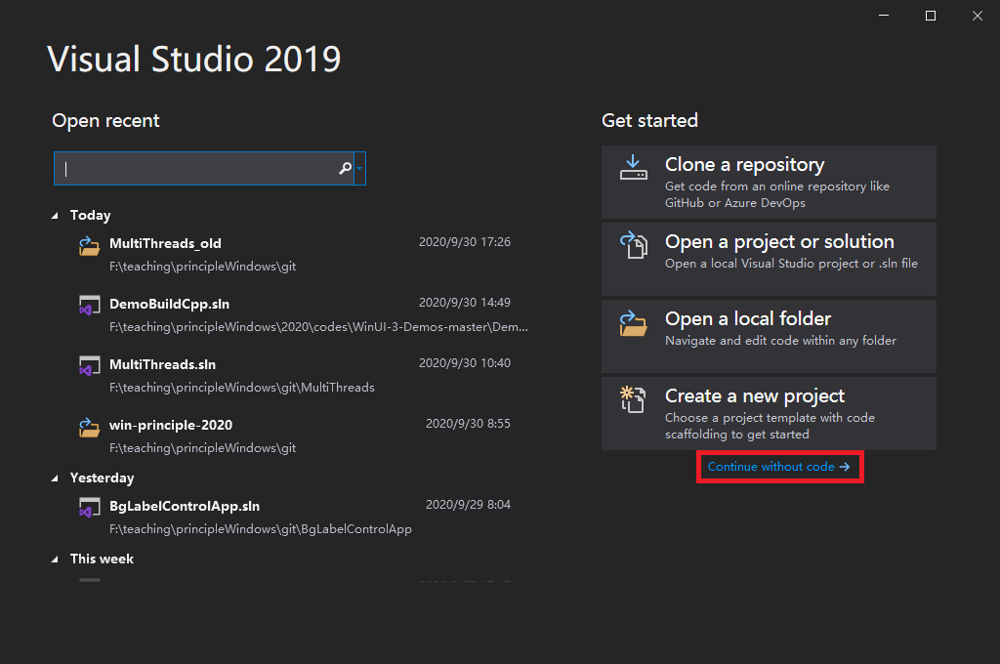
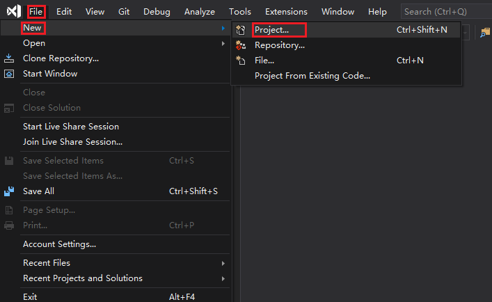
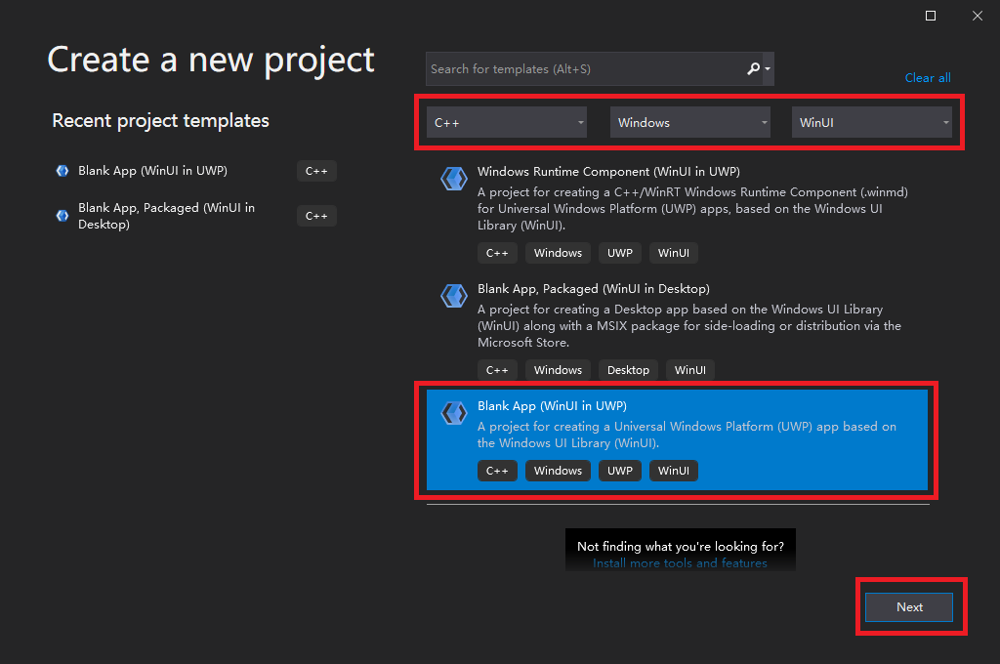
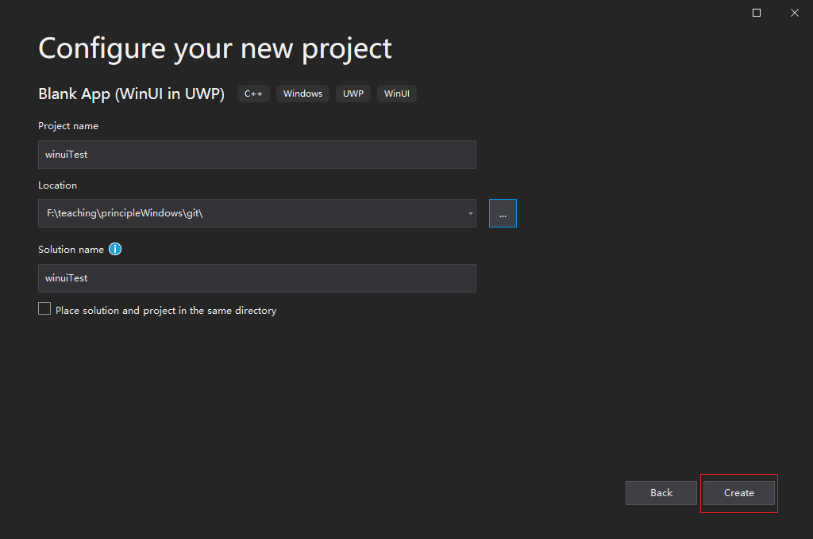
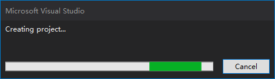
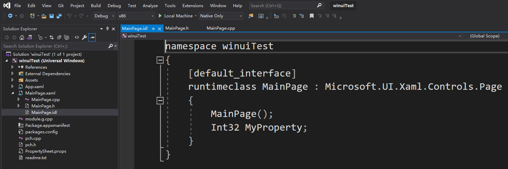
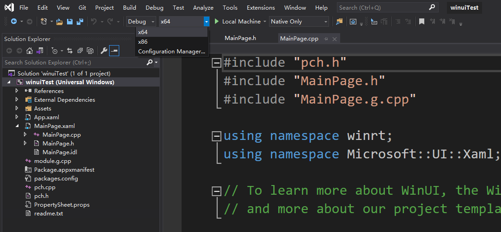
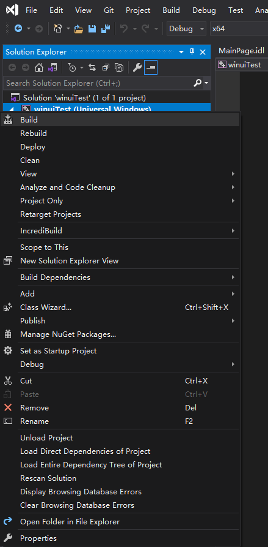
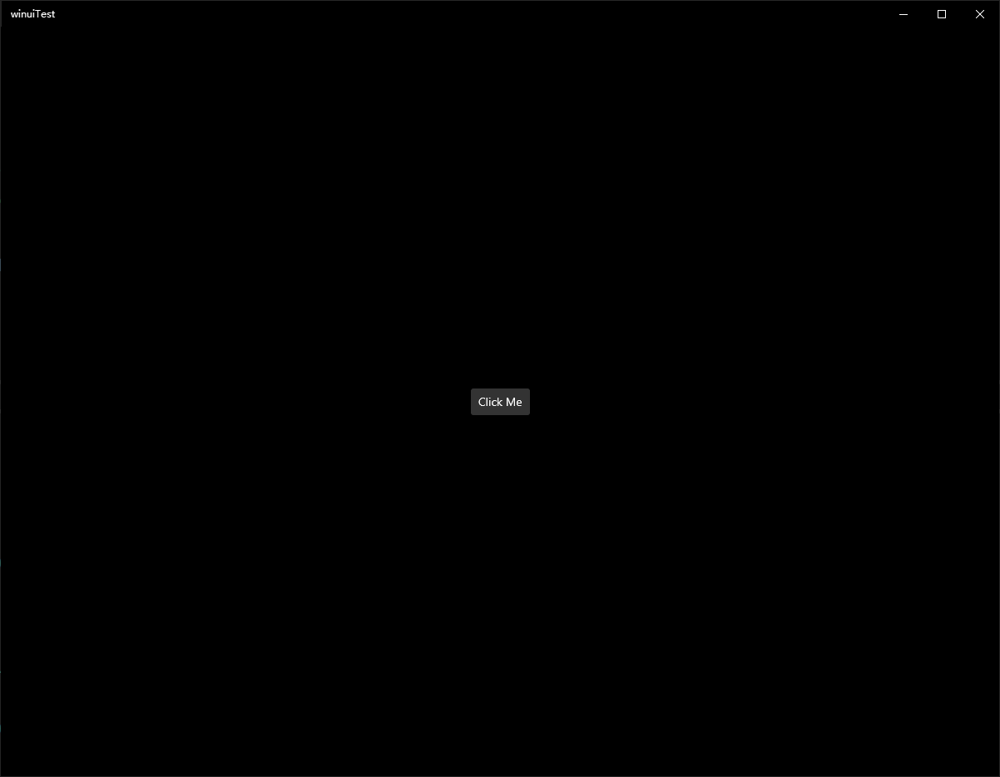

# How to create a blank app

<https://docs.microsoft.com/en-us/windows/uwp/cpp-and-winrt-apis/simple-winui-example>

***

本文介绍如何在 VS 中生成一个空的应用程序。下面以 Visual Studio 2019 Preview Community
为例子介绍整个过程, VS 2017 和 VS 2019 的其它版本可参考进行。

1. 打开 Visual Studio 2019 Preview Community (点击 continue without codes)(或者直接点击Create a new project跳到第三步)

2. 点击 File -> new -> Project

3. 在 Create a new project 对话框的右上下拉选择菜单种分别选择 [c++], 
[Windows], [WinUI], 再在出现的项目类型中选择 "Blank App (WinUI in UWP)"
后点击 Next

上面的应用程序类型可根据需要选择其它项目类型。

4. 填写欲创建的工程名称、存放位置及解决方案名称后点击 Create 按钮

5. 选择目标应用程序运行的平台版本后点击 OK

6. 然后等待...

7. 最终生成应用程序工程

8. 选择 active solution platform 为 x64

9. 右键点击项目名称后在弹出的菜单里选择 build 开始生成该项目的应用

10. 按快捷键 F5 可调试运行该程序

第一次运行会比较慢，请耐心等待。

