# How to package an application

***

在进行该实验之前，你可以选择先进行2个子实验：
1. 学会查看证书（参见 [How to View certificates](../../appendix/MSIX/viewCertificates.md)）
2. 生成证书（这个也可以在上面文章中找到）

上述两个子实验有助于对应用程序进行打包的过程的理解（详细过程参考
[Package a desktop or UWP app in Visual Studio](../../appendix/MSIX/packaging-uwp-apps.md)
）。

本实验的具体步骤如下（我们以在上个实验中生成的项目 winUITest 作为例子来进行说明）：

1. 设置 Active solution configuration 为 Release

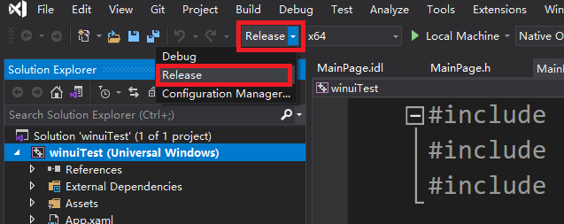

2. 右击项目名称点击 Build 生成目标应用程序（参照上个实验）

3. Right-click the project and choose Publish->Create App Packages

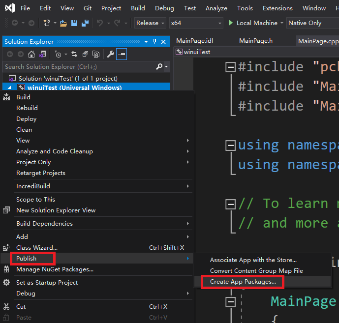

4. Select Sideloading in the first page of the wizard and then click Next

5. On the Select signing method page, select whether to skip packaging 
signing or select a certificate for signing. You can create a 
new certificate. For an MSIX package to be installed on an end user's 
machine, it must be signed with a cert that is trusted on the machine.

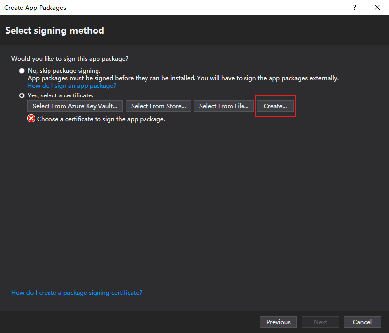

Here we click "Create..." button to create a test certificate:

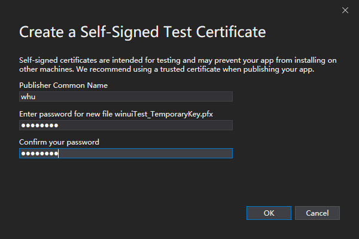

Press the button "OK" will then return to the Select signing method page:

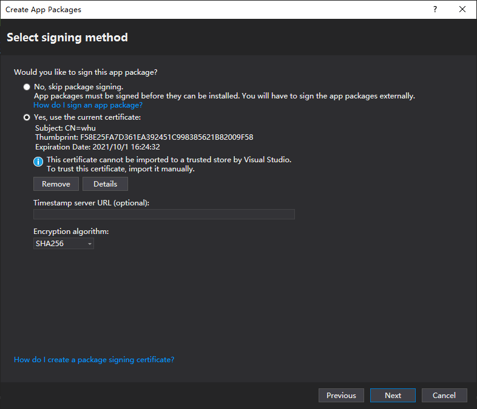

6. Complete the Select and configure packages page

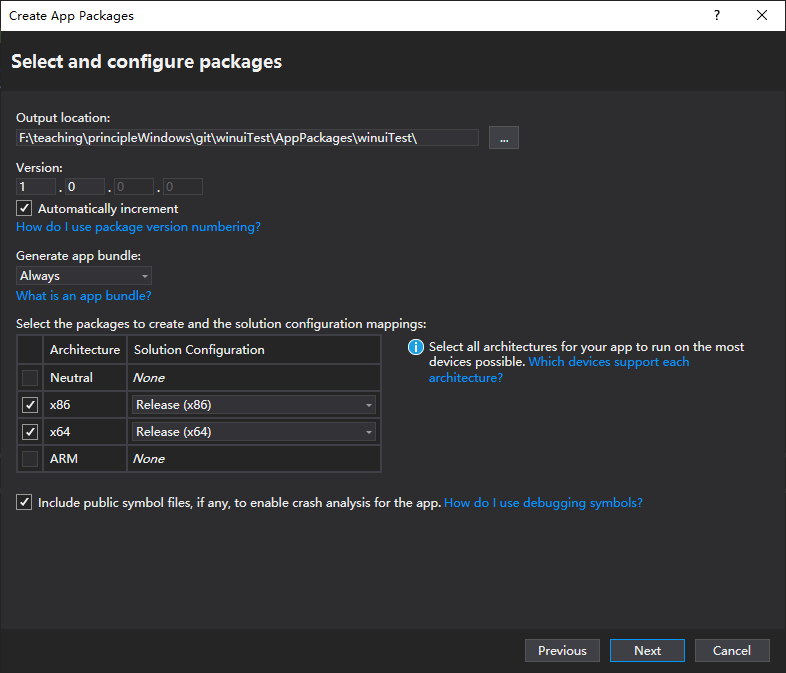

7. Input in the UNC path a local folder of your computer to store the package,
and then click the Create button

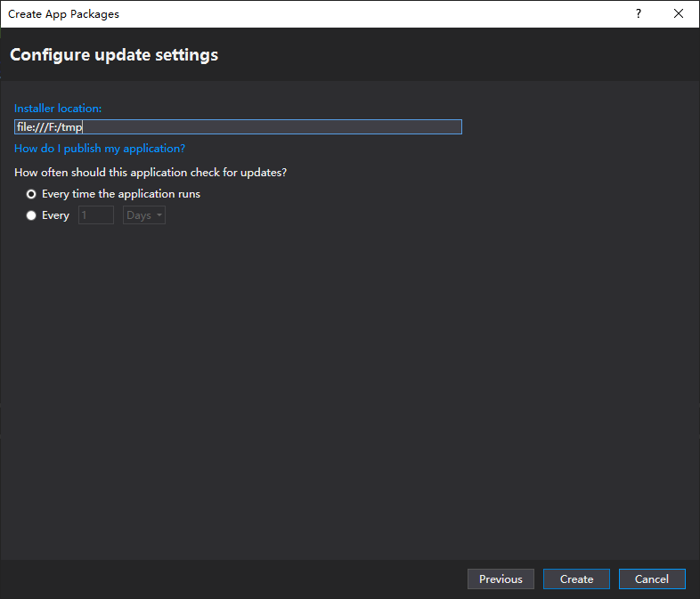

here we input "file:///F:/tmp"

8. click "copy and close" to generate the install package

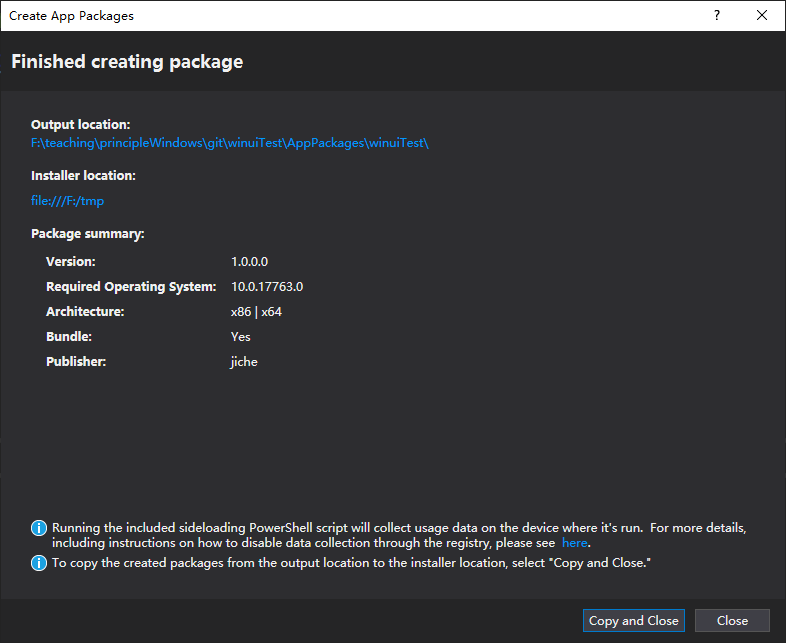

9. 现在在第7步你所输入的 UNC 路径下（这里是F:\tmp）生成了安装包，但因为安装证书
还未注册而不能使用。

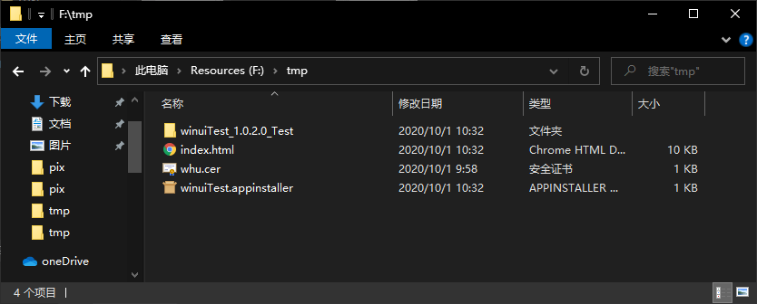

下面我们将第5步创建的测试证书进行注册（我们把前述的UNC路径称为安装包路径）：
* 打开安装包路径，进入下面的一个文件夹（这里是 winuiTest_1.0.2.0_Test）
* 该文件夹里有一个 winuiTest_1.0.2.0_x64.msixbundle 文件，右击并点击属性

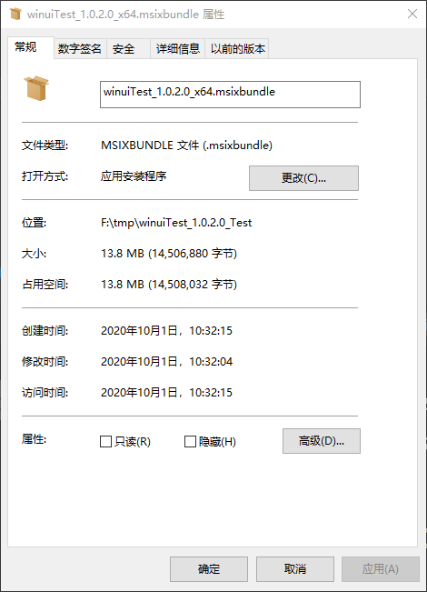

点击“数字签名”标签页后点击签名列表中的签名，然后再点依次击详细信息、查看证书、安装
证书：

当然，也可以直接打开证书文件(.cer)来进行安装：

在证书向导里点击“本地计算机”后单击下一步：

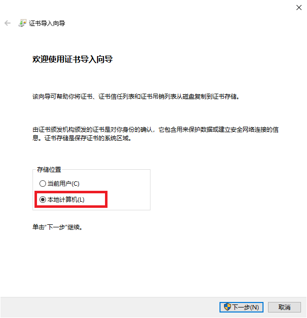

选择将所有证书都放入下列存储后再点击浏览，然后选择“受信任的根证书颁发机构”后点确定：

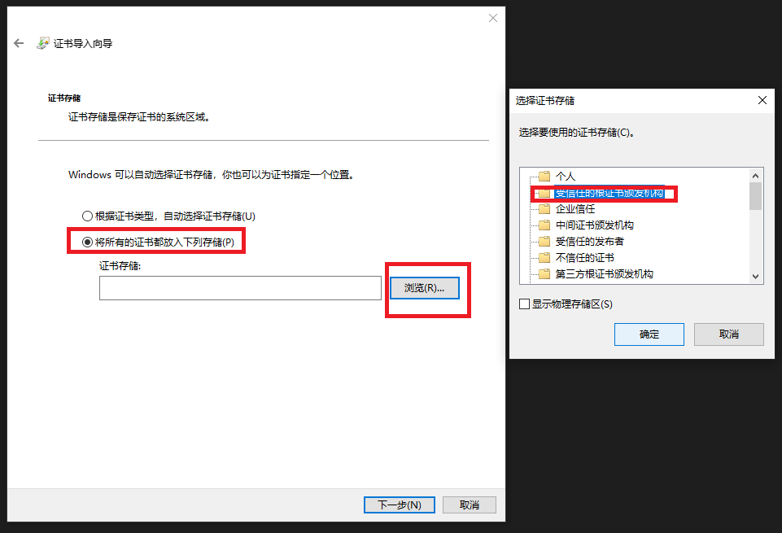

确定后点击下一步就可将证书安装到系统中。大家可以按实验开始前的子实验中的方法查看证书
是否正确安装。

10. 完成证书安装后回到安装包路径，点击其下的安装程序 winuiTest.appinstaller 就
    可以顺利完成程序的安装了。

    

    如果安装失败，提示信息为：“请向开发人员索要新的应用包。
    此应用包可能与已经安装的应用包冲突，，，，，”。这是因为你之前运行项目产生的应用程序还没有删除，
    请先把应用程序卸载，再双击winuiTest.appinstaller即可完成安装。
    安装完成后在开始菜单里就可以看到所安装的程序，点击可以启动运行：

    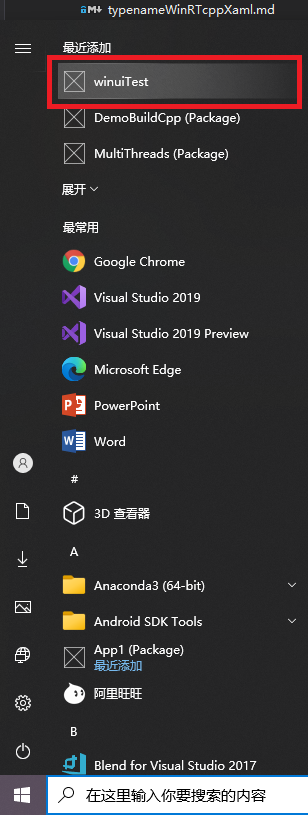

11. 如果打开安装出现如下错误：

    

    你可以忽略该错误，并且按照下一步操作，也可以成功安装应用。

12. 进入安装包目录的下一个文件夹(应用名\_版本号\_Test，在这里是winuiTest_1.0.2.0_Test)，找到文件扩展名为msixbundle的文件:

    

    双击打开它，会出现：

    

    当然，这是在安装了证书之后才会出现的界面，如果你还没有安装证书，则会出现下面的界面：

    

    请安装完证书之后再继续安装。

    至此，“解析应用包时出错“的问题就解决了！

