# Get started with WinUI 3 for desktop apps

<https://docs.microsoft.com/en-us/windows/apps/winui/winui3/get-started-winui3-for-desktop>

***

<https://github.com/principleWindows/WinUI-3-Demos>

[Windows UI Library Roadmap](https://github.com/microsoft/microsoft-ui-xaml/blob/master/docs/roadmap.md)

## 1 Configure your dev environment

### 1.1 Install Visual Studio 2019 Preview

由于 winUI 3.0 还处于 Release Candidate 状态, 还不被 Visual Studio 2019 Community 环境所正式支持,
为便利开发需要安装 Visual Studio 2019 Preview 的 Community 版本。官方下载地址：
<https://visualstudio.microsoft.com/vs/preview/>

You must include the following workloads when installing the Visual Studio Preview:
* .NET Desktop Development
* Universal Windows Platform development

To build C++ apps you must also include the following workloads:
* Desktop development with C++
* The C++ (v142) Universal Windows Platform tools optional component for the Universal Windows Platform workload

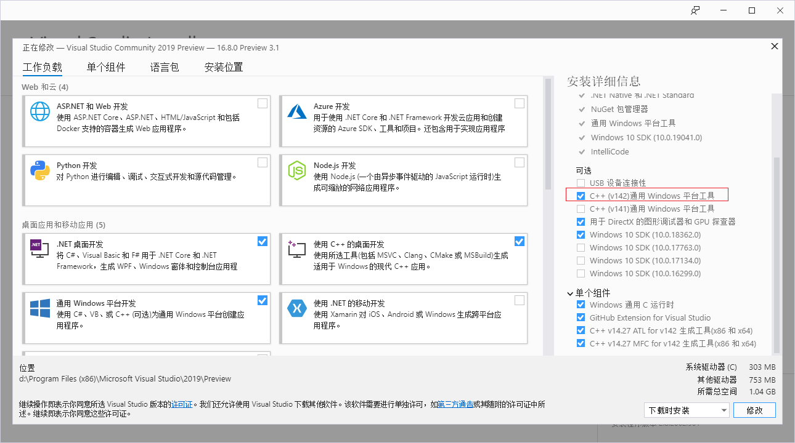

记住安装时要选择英语语言包, 并将 Visual Studio 2019 Preview 的环境配置为英语。

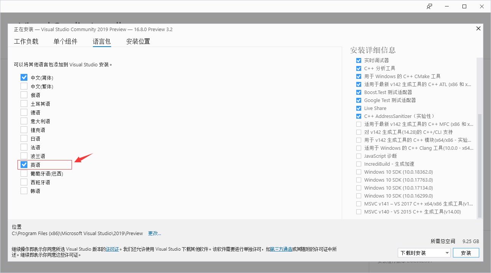

安装完成重启电脑后启动 Visual Studio 2019 Preview 。选择 **继续但无需代码** 进入VS 主界面。

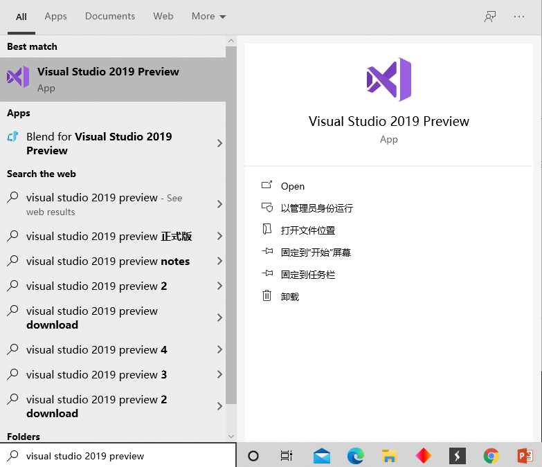

选择 **工具** -> **选项** 进入选项界面。

选择 **环境** -> **区域设置** -> **语言** -> **Engligh** 确定并重启 VS。

注意：需要在 **Visual Studio Installer** 中安装了英文语言包这里才会有 **English** 选项。如果之前没有安装可以进入 **Visual Studio Installer** 对 **Visual Studio 2019 Preview** 进行修改。

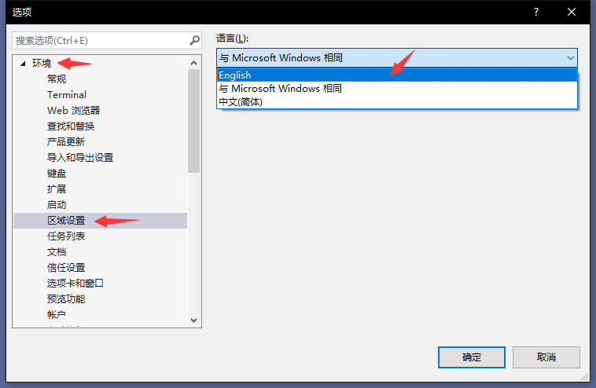

现在显示的就是英文界面啦！

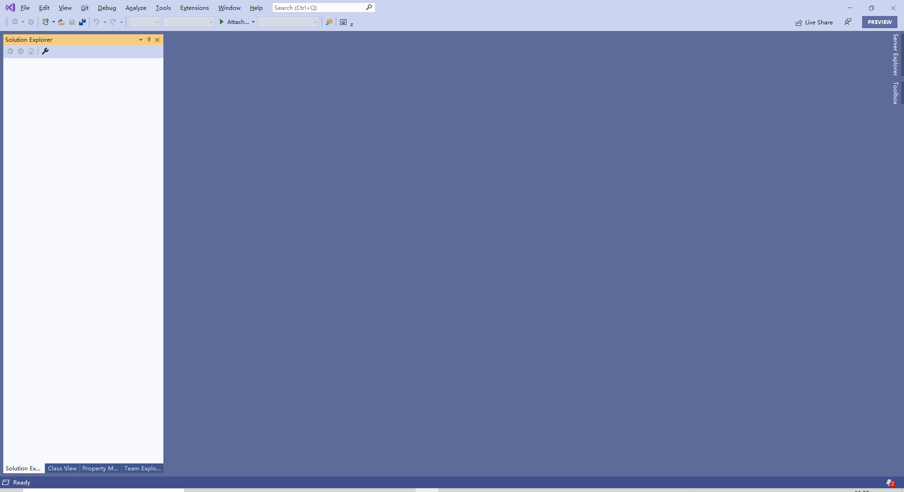

### 1.2 Install .NET 5 Release Candidate
Install both x64 and x86 versions of .NET 5 rc:

<https://dotnet.microsoft.com/download/dotnet/5.0>

### 1.3 Install WinUI 3 Preview 1 Visual Studio project templates

打开 Visual Studio 2019 Preview Community, 在 Extensions 的 Online 中搜索 
WinUI 3 Project Templates，找到后安装该插件。
**这个插件的安装非常慢！最好起大早下载安装不然很可能失败。**

也可以直接去<https://marketplace.visualstudio.com/items?itemName=Microsoft-WinUI.WinUIProjectTemplates>
下载安装。

## 2 Create a WinUI 3 desktop app for C++/Win32

<https://docs.microsoft.com/en-us/windows/apps/winui/winui3/get-started-winui3-for-desktop#create-a-winui-3-desktop-app-for-cwin32>

1. In Visual Studio 2019, select File -> New -> Project.

2. In the project drop-down filters, select C++, Windows, and WinUI.

3. Select the Blank App, Packaged (WinUI in Desktop) project type and click Next.

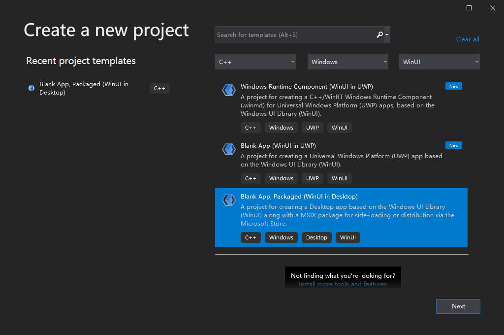

4. Enter a project name, choose any other options as desired, and click Create.

5. In the following dialog box, set the Target version to Windows 10, 
version 2004 (build 19041) and Minimum version to Windows 10, version 1809 
(build 17763) and then click OK.

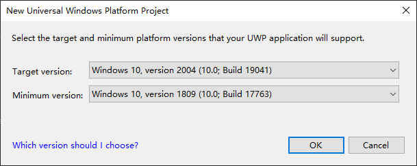

6. At this point, Visual Studio generates two projects:

* Project name (Desktop): This project contains your app's code. The App.xaml and 
various App code files define an Application class that represents your app instance, 
and the MainWindow.xaml and various MainWindow code files define a MainWindow class 
that represents the main window displayed by your app. These classes derive from 
types in the Microsoft.UI.Xaml namespace provided by WinUI.

* Project name (Package): This is a Windows Application Packaging Project that is 
configured to build the app into an MSIX package. This provides a modern deployment 
experience, the ability to integrate with Windows 10 features via package extensions, 
and much more. This project contains the package manifest for your app, and it is the 
startup project for your solution by default.

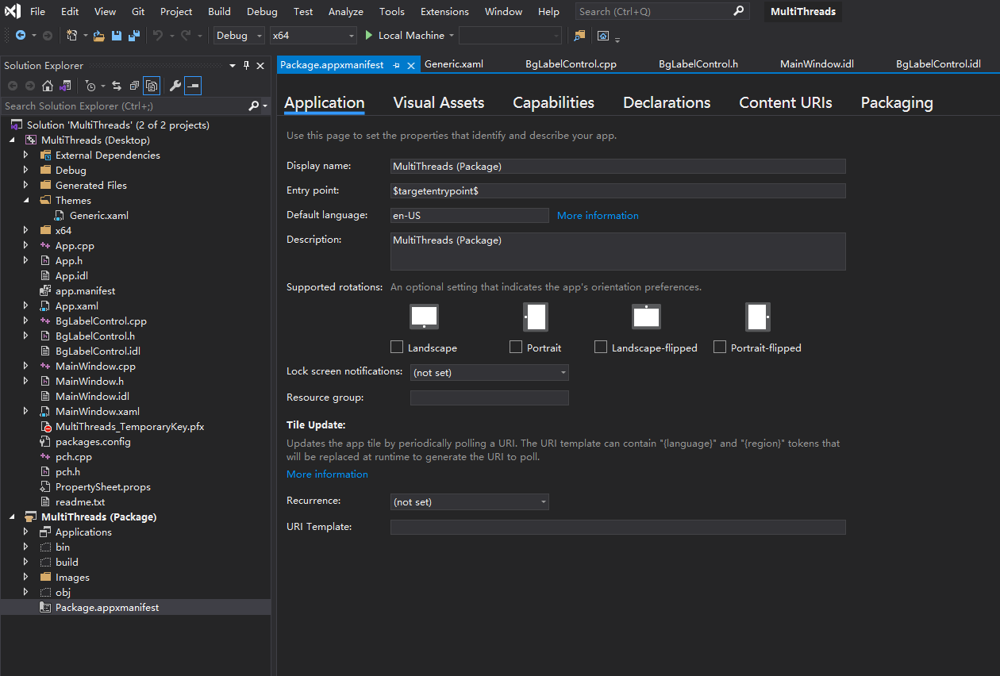

如果运行项目中个别文件找不到头文件，如pch.h文件中标红的“#include <winrt/Windows.Foundation.h>”，且运行后报错如下：

请在extensions中下载C++/WinRT插件：

下载完成后，重新rebuild项目，即可正常运行。

7. To add a new item to your app project, right-click the Project name (Desktop) project 
node in Solution Explorer and select Add -> New Item. In the Add New Item dialog box, 
select the WinUI tab, choose the item you want to add, and then click Add. For more 
details about the available items, see [this section](https://docs.microsoft.com/en-us/windows/apps/winui/winui3/#item-templates-for-winui-3).

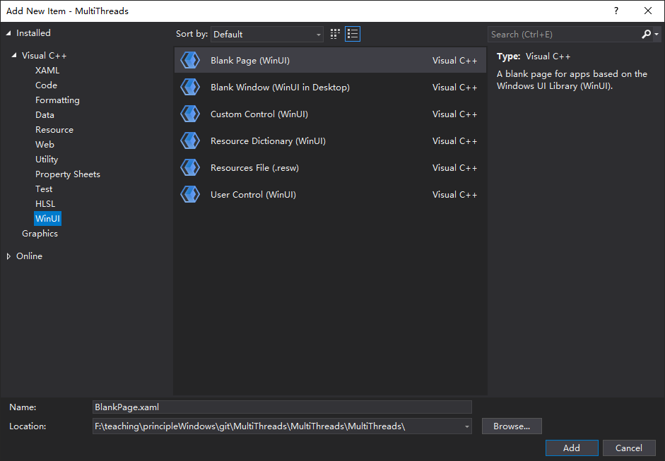

8. Build and run your solution to confirm that the app runs without errors.

9. When running apps on your desktop, Windows will require you to enable **developer mode**. 

   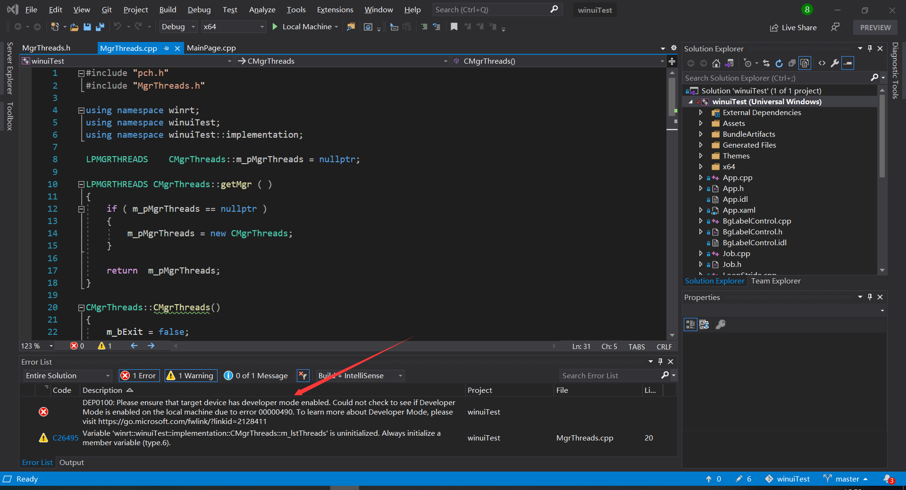

   The configuration page will appear spontaneously when you build your project, you can enable developer mode in this page.

   You can also simply enable developer mode through clicking Win-->settings-->update&security-->developer options-->developer mode.

   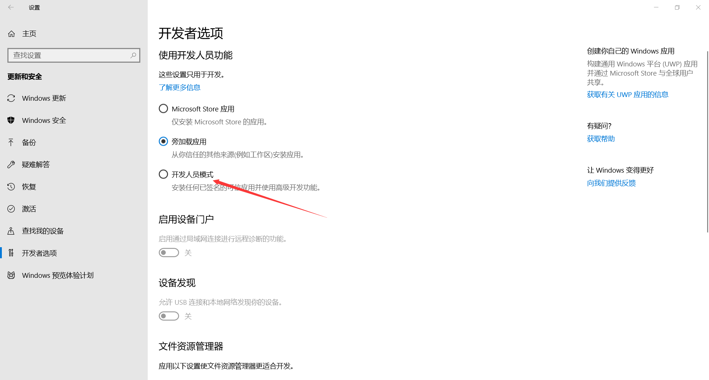

10. If your Windows OS hasn't been updated to latest version, there will exist problems when running the app.

    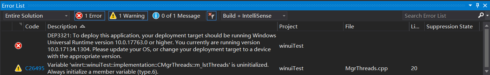

     Here are two solutions:

    a. Update your Windows OS (recommended)

    b. Reduce the minimum version requirements of the application. Right-click the UWP application project, select `Properties` , and change the **Min version** to a lower version (such as 17134). (This is not a safe method, some APIs may only be provided in higher version)

    