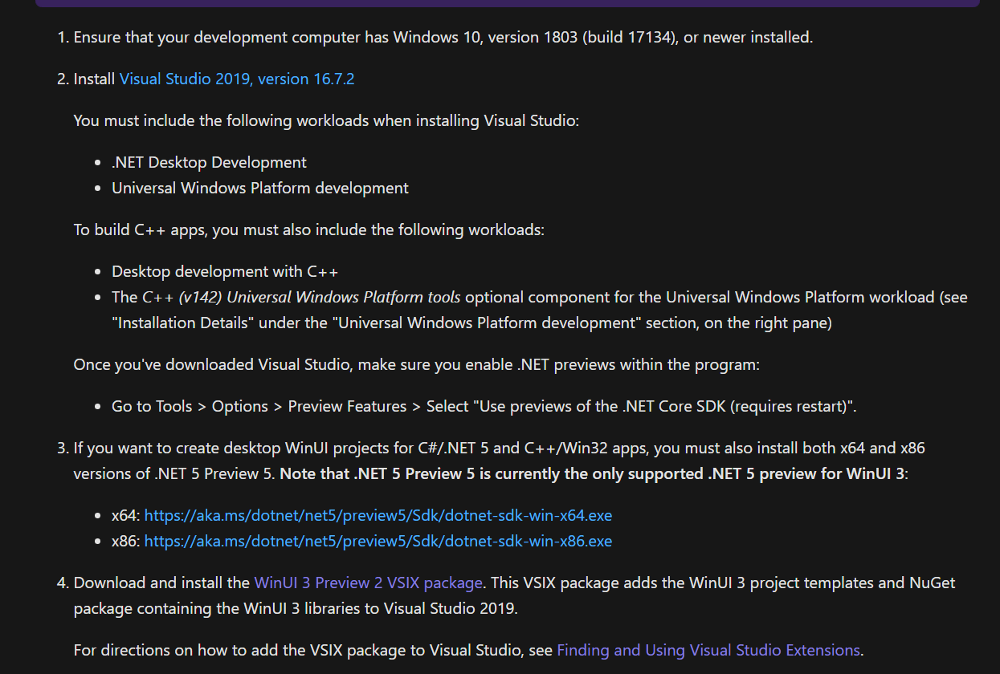
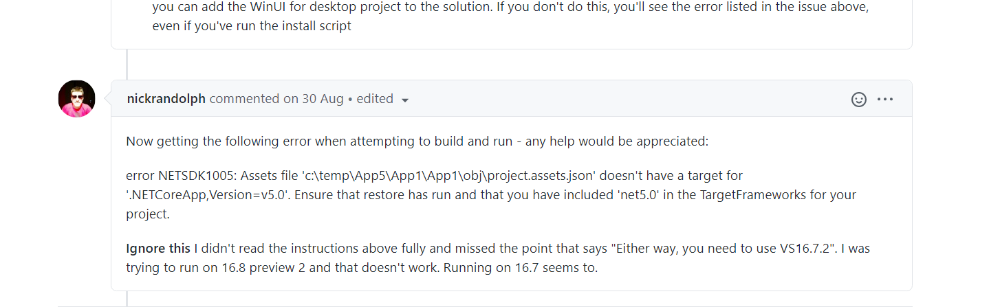
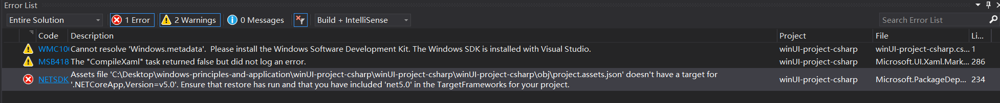

# 简要提供一些WinUI3 for C#的环境配置相关的建议

## 目录

- [完全不知道实验内容是什么也不知道去哪获取材料？](完全不知道实验内容是什么也不知道去哪获取材料？)
- [如何配置WinUI3 for C#？](如何配置WinUI3 for C#？)
- [遇到了一些问题？](遇到了一些问题？)

## 完全不知道实验内容是什么也不知道去哪获取材料？

- 首先要说明的是：**无论是创建WinUI3 for C++还是WinUI3 for C#的应用，最最最最推荐的教程莫过于微软官网**，微软官网提供的信息具有最好的时效性，因为我们实验课使用的技术属于崭新甚至未正式发布的技术，该框架更新迭代的速度非常快，故信息的时效性非常重要。

  微软教程地址如下（强烈建议阅读以下全部两个网页内容）：

  [关于安装WinUI3 preview2的整体环境介绍](https://docs.microsoft.com/en-us/windows/apps/winui/winui3/)

  [关于使用WinUI创建C#和C++的桌面应用程序](https://docs.microsoft.com/en-us/windows/apps/winui/winui3/get-started-winui3-for-desktop)

  如果你认真阅读了上述材料，应该是有很大概论能完成实验内容的。

- 关于其他信息来源：**首先在该课程实验中你必须放弃面向CSDN编程或者面向百度的思想**。也就是说当你遇到问题的时候不要第一时间去百度上搜索，大概率得不到你想要的解决办法。如上一条所说，由于该实验课使用的技术比较新，国内几乎没有在这方面很有经验的编程者，也没有内容非常有质量的博客。如果你遇到配置环境的问题，建议按照以下顺序搜索解决方案 google->stackoverflow->github issues

## 如何配置WinUI3 for C#？

非常遗憾在写下这篇文档的时候我并**没有**成功配置好WinUI3 for C#的环境，但仍能提供一些建议。

简要说一下原因：



首先我们看到微软官网上提供的使用WinUI的依赖项，其中比较重要的几项如下：

- Visual Studio 2019 version 16.7.2

- .NET 5 preview 5(包括x64和x86两个版本)

作为对比我列出我现在环境中使用的依赖项和目前最新的依赖项

我目前如下：

- Visual Studio 2019 version 16.8.0 Preview 3.2
- dotnet-sdk-5.0.100-preview.5.20279.10-win-x86(and x64)

目前最新的依赖项版本如下（截至2020.9.30）：

- Visual Studio 2019 version 16.8.0 Preview 3.2

- dotnet-sdk-5.0.100-preview.8.20417.9-win-x86.exe(and x64)

关于.net core的版本：尽管没有测试.net 5 preview 8版本是否符合环境要求，但是测试过.net 5 preview 5（也就是官网上推荐的版本）是可以的。

但是**很重要的是：Visual Studio的版本必须匹配**，也就是说Visual Studio的版本必须是16.7.2而不能是最新的16.8.0

这个问题并不是我一个人遇到，在查看github issue时也有人反映了同样的情况。



从最后一段可以看到，该用户同样是使用Visual Studio 16.8 preview 2的时候无法运行WinUI3 for C#的程序，当回滚到16.7的时候能成功运行。

鉴于我目前并没有找到非常安全和高效的回滚Visual Studio版本的办法，也不想卸载当前版本重新安装，故没能成功置好WinUI3 for C#。

## 遇到了一些问题？

- 创建WinUI3 for C#时遇到问题

  该问题主要是因为.net core的版本不匹配，**建议使用.net core 5 preview 5**。

  同时要注意的是Visual Studio的创建WinUI程序模板的扩展是直接用环境变量中的dotnet命令创建的，而非传统的WPF程序是在创建程序的时候手动指定使用的.net core的版本。

  所以无论你的电脑中安装了多少个.net core的版本，你必须**调整dotnet在系统变量和用户变量中的位置，以确保在PATH中最靠前的dotnet命令是使用.net core 5 preview 5版本的。**

  以下两个指令来查看.net core的相关版本信息

  查看当前.net core使用的版本

  ```shell
  dotnet --version 
  ```

  查看电脑中所有.net core的版本

  ```
  dotnet --list-sdks
  ```
  
- 已经成功创建了WinUI for C#程序，编译时出现问题

  该问题即是最难解决的问题，visual studio版本不匹配，该问题只能期待visual studio在后续的版本更新中添加向下兼容以解决兼容性的问题。

最后非常非常感谢你能看到这里，如果我踩过的这些坑能给你提供一些帮助的话，我会非常开心。
