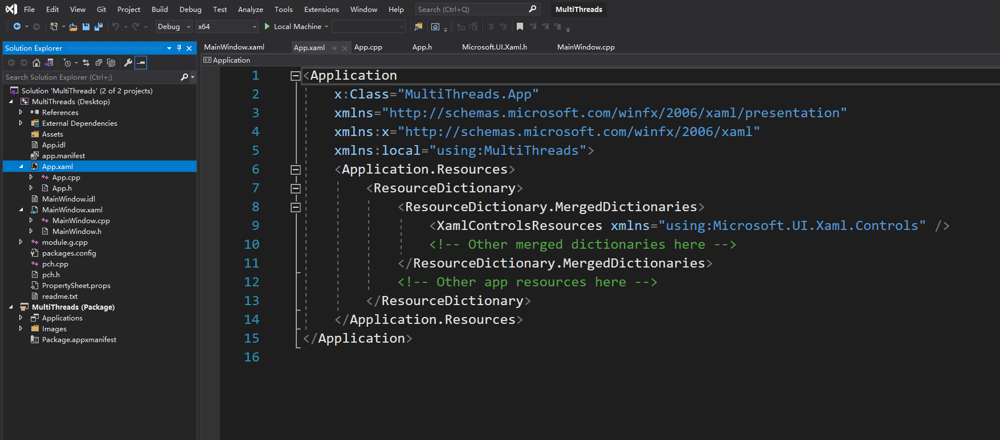

# Templated XAML controls

Please refer to [Templated XAML controls for UWP and WinUI 3 apps with C++/WinRT](https://docs.microsoft.com/en-us/windows/apps/winui/winui3/xaml-templated-controls-cppwinrt-winui3),
which describes the same scenario as the article 
[XAML custom (templated) controls with C++/WinRT](https://docs.microsoft.com/en-us/windows/uwp/cpp-and-winrt-apis/xaml-cust-ctrl) 
but has been adapted to use WinUI 3.

***

Templated controls inherit from Microsoft.UI.Xaml.Controls.Control and 
have visual structure and visual behavior that can be customized using 
XAML control templates.

The XAML classes for WinUI 3 library are in Microsoft.UI.Xaml namespaces. 
This is what distinguishes them as WinUI controls as opposed to UWP XAML 
controls, which are defined in Windows.UI.XAML namespaces.
Microsoft is currently in the progress of breaking out the entire 
interface layer that contains the modern Windows controls and styles from 
the operating system into a separate WinUI 3 framework that will ship 
later this year.

The Nuget package [Microsoft.UI.Xaml](https://www.nuget.org/packages/Microsoft.UI.Xaml)
provides backward-compatible versions of Windows UI features including UWP 
XAML controls, and Fluent styles and materials. It is part of the 
Windows UI Library. <font size=5>(亦即 Microsoft.UI.Xaml 是向后兼容的手段)</font>


 **XAML 条件编译?**

XAML 使得界面设计与业务逻辑得以分离，程序员编写业务逻辑代码，
前台界面设计则可由设计人员采用 XAML 来进行。

在 C++ winUI 程序中, APP 文件是程序的入口。


1. 标签对象元素(Object Elements)<br>
每个标签对应一个对象元素，编译器将其解析为某个类的实例。
下面的代码就是一个标签对象元素，运行时会被解析为一个 
\:\:winrt\:\:Microsoft\:\:UI\:\:Xaml\:\:Controls\:\:Button 对象实例。
```cpp
<Button x:Name="myButton" Click="myButton_Click">Click Me</Button>
```


