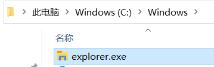
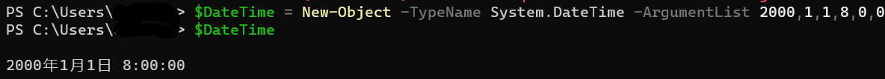
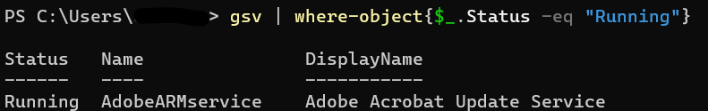
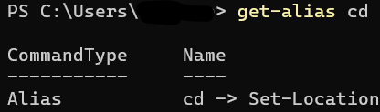
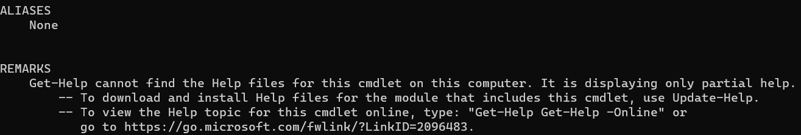
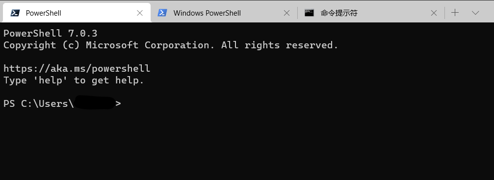
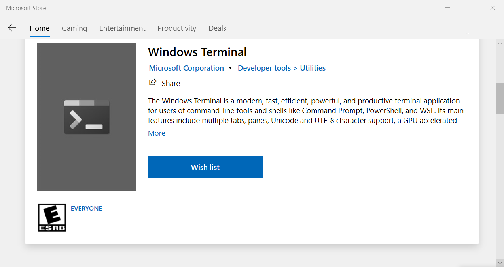
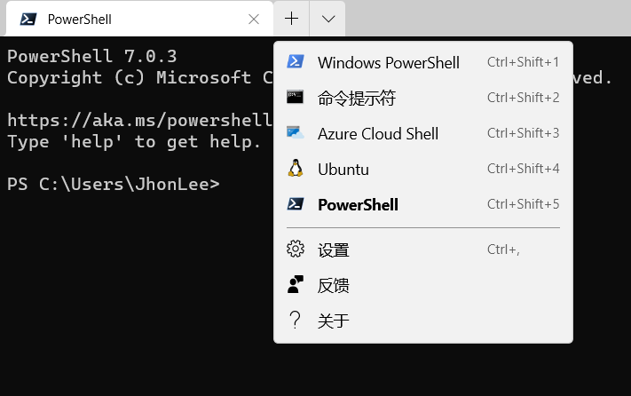

## 从Shell 到 PowerShell  
***  
在Windows编程中，我们时常要与操作系统打交道。从启动服务到测试代码执行，shell是我们离不开的搭档。下面，本文将循序渐进，依次介绍Windows下shell的概念，新一代Shell——PowerShell以及现代化的命令行终端——Windows Terminal。  
### 1、Shell是什么
在Windows中，**内核**（Kernel）作为对于硬件的第一层软件扩充，通过硬件抽象的方法为程序提供了简洁的接口进行软/硬件交互。对于用户而言，又如何与系统进行“交流”？Windows为此提供了Shell，其位于操作系统外层，也是一个程序，用户可以使用它输入命令，它将在接受到命令之后派生子进程(子进程产生的错误可以不影响主进程的执行)进行解释并且将解析出的指令传达给系统内核，同理，其也会将内核运算的结果反馈给用户。  
在windows中，shell可以按是否有图形界面分为两种：  
#### 1.1、	图形界面Shell  
在windows中，系统启动后默认会打开**explorer.exe**（文件资源管理器）。其运用组件化的思想负责了任务栏，桌面等等系统可见部分的处理和显示，用户也可以使用它对系统的文件资源进行管理，执行命令。例如，当我们双击桌面的ie.exe图标时，就相当于给文件资源管理器这个shell传递了一个“打开ie”的指令，shell接受到后会解释并且传递到内核，通过参数的形式告诉内核应该开始对运行ie做准备了。正因如此，当explorer.exe出现崩溃的时候，系统会自动重新启动它，否则任务栏，文件管理器，桌面图标等等功能都不复存在，也就几乎不可能使用图形界面来使用操作系统了。  
  

#### 1.2、	命令行式Shell  
顾名思义，命令行式的Shell就是一种使用纯文字界面的shell。其来历最早可以追溯到DOS时代，那时候，DOS系统就是一个纯文字交互的操作系统，进入windows时代之后，虽然内核已经变成了NT10.0(截至2020年的Windows 10系统)，但是为了照顾那些仍旧偏好文字交互的人们，windows使用根据历史习惯进行了复刻，也就是我们现在常见的**cmd.exe**。  
### 2、	Cmd以及PowerShell  
#### 2.1	什么是PowerShell  
从Windows XP起，微软为Windows提供了PowerShell软件。作为传统shell(cmd.exe)的超集，其基于 \.NET，包含命令行管理程序与脚本语言。用户可以使用它进行操作系统的管理，更可以利用其基于 \.Net的特性简化操作，创建自动化脚本。  
#### 2.2	为什么要使用PowerShell  
相比老式的命令行，PowerShell的特别之处突出体现在以下几点：  
##### 2.2.1	PowerShell 是基于对象操作的  
相比于其他Shell返回的是字符串，基于 \.Net框架的PowerShell可以直接获得返回的**对象**，进行进一步处理，例如下面的例子中，将使用New-Object创建一个日期对象：  
> ```ps>$DateTime = New-Object -TypeName System.DateTime -ArgumentList 2000,1,1,8,0,0```  
>   
上面的指令含义是在基于 \.Net DateTime类通过传入参数创建一个新的对象。面向对象的方法可以减少出错的几率，还可以在接下来介绍的管道功能中发挥作用。  

##### 2.2.2	面向对象的管道功能
虽然cmd也支持使用管道功能对之前指令的结果进行传参，但是PowerShell传递的是一个对象而不是文本，这样就可以充分利用属性和函数进行操作了。参照下面的例子：  
> ```ps>gsv | where-object{$_.Status -eq "Running"}```  
Gsv可以列出系统所有的服务，获得服务对象后，使用’|’符号创建管道传递到where-object命令中，对每个对象’$_’提取Status属性进行判断，筛选去等于（-eq）运行(Running)的服务  


##### 2.2.3	可拓展的命令  
PowerShell中命令叫做cmdlet，其基于 \.Net，是一个.Net类的实例。用户可以根据标准，使用C#等编程语言创建自己的cmdlet（代码示例可以参考[官方文档](https://docs.microsoft.com/zh-cn/powershell/scripting/developer/cmdlet/how-to-write-a-simple-cmdlet?view=powershell-7))  
##### 2.2.4	强大的.Net支持  
因为其基于 \.Net，所以可以直接使用它引用各类.Net类库，大大地拓展了PowerShell脚本的功能。  
#### 2.3.如何更好地迁移到PowerShell  
选择PowerShell还是cmd要具体根据用户的需求进行，不必强求“用PowerShell就更加Powerul”的观点。但是，如果想要快速地熟悉PowerShell的日常使用，下面的功能会起到作用  
+ 2.3.1 ```get-alias```	cmdlet中普遍采用”动词-名词”的命名方式，暂且不论是否美观，我们可以用这个方法查询到在cmd中的命令在PowerShell中真正的名字。  
示例：```ps>get-alias cd```  
查看cd在PowerShell中的名字  
  

+ 2.3.2 ```Get-Command```	使用这个cmdlet可以列出所有支持cmdlet,可以搭配 -Name参数进行筛选  
示例：```ps>Get-Command -Name Get-*```  
查找所有以 Get- 开头的cmd-let  
+ 2.3.3 ```get-help``` 它可以查询各类帮助文档  
示例：```ps>get-help get-help```  
查询get-help命令的作用  
  
 
### 3、使用现代化的命令行终端——Windows Terminal  
在2019的开发者大会中，windows推出了面向命令行用户的现代化终端——Windows Terminal，经过一年更新，官方推出了正式版本，意味着我们可以轻松地上手使用它了。相对于传统的终端，同样是基于命令行，Windows Terminal有着如下突出的特点：  
+ 主题自定义  
不必再是对着黑漆漆的屏幕发呆，用户可以自己选择配色方案，背景主题等等。  

+ 对于Unicode 和 UTF-8 字符支持  
现在许多项目都喜欢在构建过程中使用emoji进行表示应用状态，terminal对于各种字符的支持大大减少了在处理乱码上花费的时间。  

+ 支持多标签页  
类似于浏览器，用户可以轻松的在多个窗口之间切换，还可以在同一个页面显示多个终端。  
  

+ 支持连接WSL，AZURE等系统  
Windows Terminal可以自动配置系统中装配的虚拟机，可以直接打开虚拟机终端。  

#### 3.1	如何安装  

可以选择从微软官方Github仓库进行下载自行编译，不过最佳的方式仍旧是在Microsoft Store（win10以上）进行下载安装，不但管理方便，还可以享受商店提供的自动更新的功能。  
  

#### 3.2	如何配置  
当前，Windows Terminal暂未提供GUI设置界面，但是可以通过参照文档修改Json进行配置。下面以介绍如何增加PowerShell7.0为例进行讲解。
首先，往设置json的profiles中的list内添加如下项  
    ``` {
                "guid": "{574e775e-4f2a-5b96-ac1e-a2962a402336}",
                "hidden": false,
                "name": "PowerShell",
                "source": "Windows.Terminal.PowershellCore"
            }
    ```  
根据[文档](https://docs.microsoft.com/zh-cn/windows/terminal/customize-settings/profile-settings)，guid是唯一的标识符，hidden决定是否暂时隐藏这个功能，name是其在新建标签页时显示的标识符，source指向基于PowershellCore的PowerShell 7.0。  
接下来，设置defaultProfile为```{574e775e-4f2a-5b96-ac1e-a2962a402336}```，这样，以后每次打开Windows Terminal就可以默认打开PowerShell 7.0了！  

