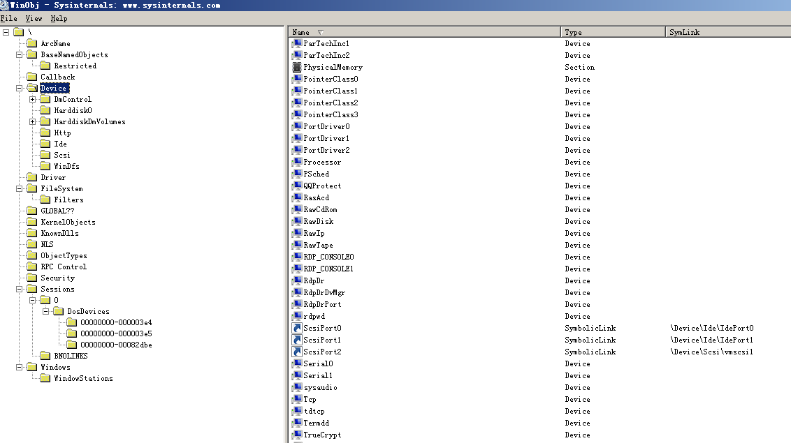

# Windows和Linux文件系统的异同
## 相同点
Linux和Windows都支持**多种文件系统**。文件资源可以通过**NetBIOS、FTP或者其他协议**与其他客户机共享。可以很灵活地对各个独立的文件系统进行组织，由管理员来决定它们在何处可以以何种方式被访问。
## 不同点
### 根文件系统
* 在传统的**Windows**机器上目录结构中，可能会包括C或者D盘，而他们一般就称之为**特定逻辑磁盘的根目录**。从文件系统的层面来说，每一个分区都包含了一个根目录区，也即系统中存在**多个根目录**。  
* 但是，在**Linux系统中**，目录结构与Windows上有较大的不同。系统中**只有一个根目录**，路径是“/”，而其它的分区只是挂载在根目录中的一个文件夹，如“/proc”和“system”等，这里的“/”就是Linux中的根目录。  
* Linux的根文件系统以**树型结构**组织，**包含内核和系统管理所需要的各种文件和程序**，一般说来根目录”/”下的顶层目录都有一些比较固定命名和用途。  
    下面列出了一个Linux根文件系统中的比较常见的目录结构：  
    * /bin 存放二进制可执行命令的目录  
    * /dev 存放设备文件的目录  
    * /etc 存放系统管理和配置文件的目录  
    * /home 用户主目录，比如用户user的主目录就是/home/user，可以用~user表示  
    * /lib 存放动态链接共享库的目录  
    * /sbin存放系统管理员使用的管理程序的目录  
    * /tmp 公用的临时文件存储点  
    * /root 系统管理员的主目录  
    * /mnt 系统提供这个目录是让用户临时挂载其他的文件系统。  
    * /proc 虚拟文件系统，可直接访问这个目录来获取系统信息。  
    * /var 某些大文件的溢出区  
    * /usr 最庞大的目录，要用到的应用程序和文件几乎都在这个目录。  
### 万物皆文件?
* Linux 中所有内容都是以文件的形式保存和管理的，即**一切皆文件**，普通文件是文件，目录（Windows 下称为文件夹）是文件，硬件设备（键盘、监视器、硬盘、打印机）是文件，就连套接字（socket）、网络通信等资源也都是文件。
* 和 Windows 系统不同，Linux 系统没有 C 盘、D 盘、E 盘那么多的盘符，**只有一个根目录（/）**，所有的文件（资源）都存储在以根目录（/）为树根的**树形目录结构**中。
* **Windows的内部实现也近似于“一切皆文件”的思想**，但这一切都只在内核里才有，下载一个WinObj这软件就可以看到，Windows上各种设备、分区、虚拟对象都是挂载到根“\”下的，通过这个树可以访问各种设备、驱动、文件系统等等。

* Windows与Linux不同的就是把这些对象又**重新封装了一层WindowsAPI**，对外以设备、盘符、文件等等表现出来，重新封装WindowsAPI的目的是为了**兼容性**，而设备、盘符、文件这些是为了**让普通用户更好理解**。
* **利弊**
    * **统一**一切设备的操作，开发者仅需要使用一套 API 和开发工具即可调取 Linux 系统中绝大部分的资源。举个简单的例子，Linux 中几乎所有读（读文件，读系统状态，读 socket，读 PIPE）的操作都可以用 read 函数来进行；几乎所有更改（更改文件，更改系统参数，写 socket，写 PIPE）的操作都可以用 write 函数来进行。
    * 不利之处在于，使用任何硬件设备都必须与根目录下某一目录执行**挂载操作**，否则无法使用。我们知道，本身 Linux 具有一个以根目录为树根的文件目录结构，每个设备也同样如此，它们是相互独立的。如果我们想通过 Linux 上的根目录找到设备文件的目录结构，就必须将这两个文件系统目录合二为一，这就是挂载的真正含义。

### 文件名
#### 文件名大小写
* windows系统中**默认是关闭区分大小写**的
* Linux环境下，文件名对大小写敏感
#### 文件名的组成
* Windows由**主文件名和扩展文件名**两部分组成
* Linux中没有扩展名的概念，**Linux不使用文件名扩展来识别文件的类型。**
#### 文件名的长度限制
* Windows 通常限定文件名最多包含**260**个字符。
* 在linux中，使用**默认的Ext2/Ext3文件系统**，因此：
    * 单一文件或目录的最大容许文件名为**255**个字符
    * 包含完整路径名称及目录（/）的完整名为**4096**个字符
 